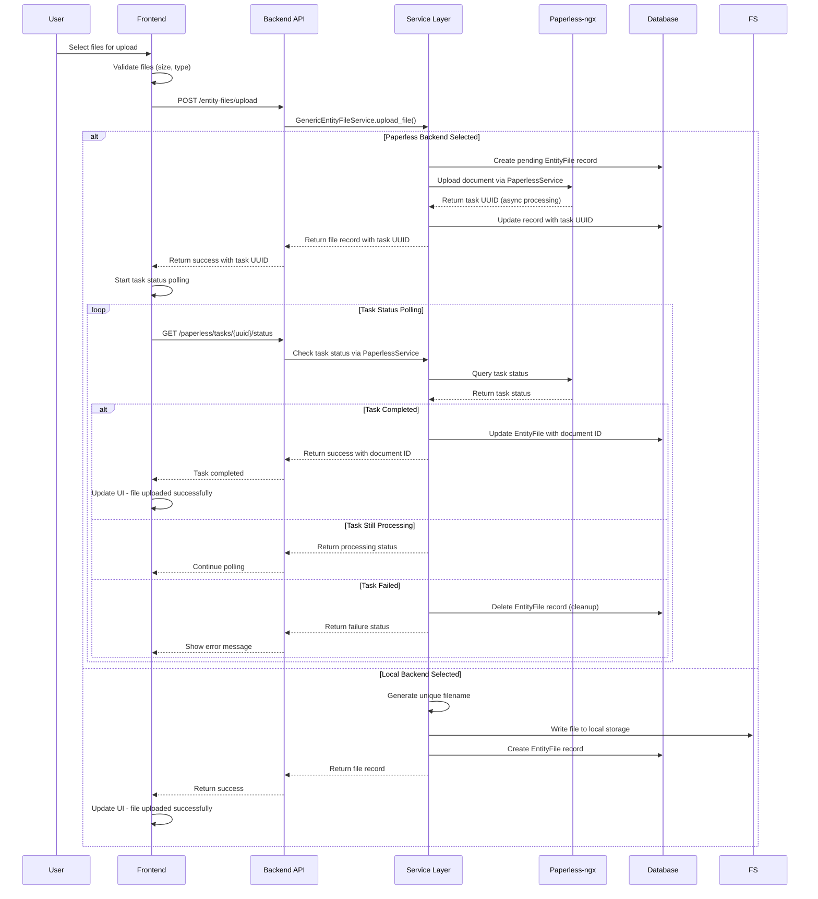
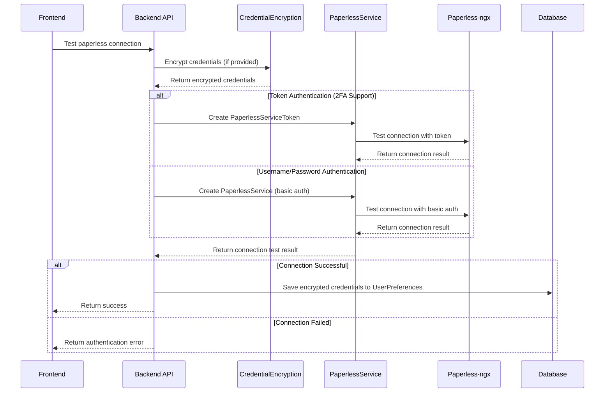
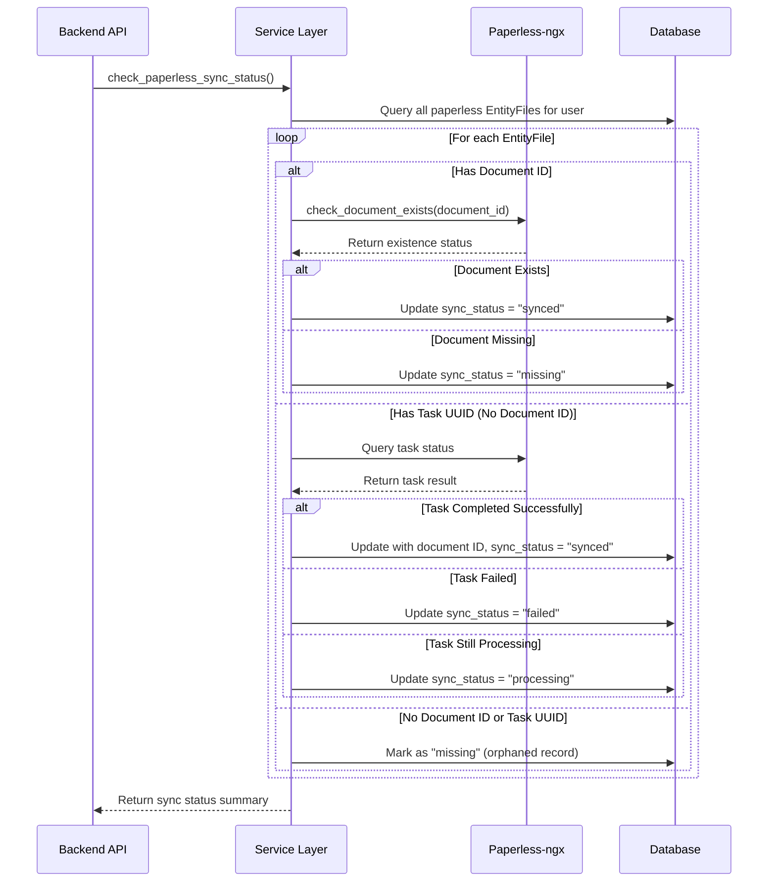

# Paperless System Architecture - Technical Documentation

## Table of Contents
1. [System Architecture Overview](#system-architecture-overview)
2. [Data Flow Diagrams](#data-flow-diagrams)
3. [API Endpoints and Methods](#api-endpoints-and-methods)
4. [Database Schema and Models](#database-schema-and-models)
5. [Authentication Patterns](#authentication-patterns)
6. [File Lifecycle Management](#file-lifecycle-management)
7. [Error Handling Patterns](#error-handling-patterns)
8. [Configuration Management](#configuration-management)
9. [Integration Points](#integration-points)
10. [Recent Code Updates](#recent-code-updates)
11. [Current Problems and Technical Debt](#current-problems-and-technical-debt)

---

## 1. System Architecture Overview

### High-Level Architecture

The paperless integration system follows a multi-layered architecture with clear separation of concerns:

```
┌─────────────────────────────────────────────────────────────┐
│                     Frontend Layer                          │
├─────────────────────────────────────────────────────────────┤
│ React Components:                                           │
│ • DocumentManagerCore.js - Main coordination               │
│ • PaperlessSettings.js - Configuration UI                  │
│ • StorageBackendSelector.js - Backend selection            │
│ • UploadProgressModal.js - Upload tracking                 │
└─────────────────────────────────────────────────────────────┘
                                │
                                ▼
┌─────────────────────────────────────────────────────────────┐
│                    API Service Layer                        │
├─────────────────────────────────────────────────────────────┤
│ Services:                                                   │
│ • paperlessApi.js - Frontend API client                    │
│ • apiService.js - Base HTTP client                         │
│ • frontendLogger.js - Logging service                      │
└─────────────────────────────────────────────────────────────┘
                                │
                                ▼
┌─────────────────────────────────────────────────────────────┐
│                   Backend API Layer                         │
├─────────────────────────────────────────────────────────────┤
│ FastAPI Endpoints:                                          │
│ • /paperless/* - Main paperless endpoints                  │
│ • /entity-files/* - Generic file management                │
│ Authentication & Authorization                              │
└─────────────────────────────────────────────────────────────┘
                                │
                                ▼
┌─────────────────────────────────────────────────────────────┐
│                    Service Layer                            │
├─────────────────────────────────────────────────────────────┤
│ Core Services:                                              │
│ • PaperlessService - Paperless-ngx integration             │
│ • GenericEntityFileService - File operations               │
│ • CredentialEncryption - Security service                  │
│ • FileManagementService - Local file operations            │
└─────────────────────────────────────────────────────────────┘
                                │
                                ▼
┌─────────────────────────────────────────────────────────────┐
│                   Data Layer                                │
├─────────────────────────────────────────────────────────────┤
│ • PostgreSQL Database (Primary storage)                    │
│ • Local File System (Local storage backend)                │
│ • Paperless-ngx Instance (External storage backend)        │
└─────────────────────────────────────────────────────────────┘
```

### Key Components

#### Frontend Architecture
- **DocumentManagerCore.js**: Central state management and coordination
- **React Hooks**: useUploadProgress, useFormSubmissionWithUploads
- **Mantine UI**: Component library with integrated error handling
- **State Management**: React hooks with performance optimizations

#### Backend Architecture
- **FastAPI Framework**: Async/await based API server
- **SQLAlchemy ORM**: Database abstraction with Alembic migrations
- **Dependency Injection**: FastAPI's dependency system
- **Async Architecture**: Full async support for I/O operations

#### Storage Architecture
- **Dual Backend Support**: Local filesystem and Paperless-ngx
- **Entity File System**: Generic file management across all entity types
- **Sync Status Tracking**: Real-time sync status monitoring
- **Task Monitoring**: Asynchronous task completion tracking

---

## 2. Data Flow Diagrams

### File Upload Flow



### Authentication Flow



### Sync Status Check Flow



---

## 3. API Endpoints and Methods

### Paperless Integration Endpoints

#### Core Endpoints
```python
# app/api/v1/endpoints/paperless.py

@router.post("/test-connection", response_model=Dict[str, Any])
async def test_paperless_connection(
    connection_data: PaperlessConnectionData,
    current_user: User = Depends(get_current_user),
    db: Session = Depends(get_db)
) -> Dict[str, Any]:
    """Test connection to paperless-ngx instance with dual authentication support."""
    # Smart authentication factory: prioritizes token over username/password
    # Supports both 2FA (via token) and basic authentication
```

#### Settings Management
```python
@router.get("/settings", response_model=Dict[str, Any])
async def get_paperless_settings(...)
    """Get paperless settings without exposing encrypted credentials."""

@router.put("/settings", response_model=Dict[str, Any]) 
async def update_paperless_settings(...)
    """Update paperless settings with credential encryption."""
```

#### Task Monitoring
```python
@router.get("/tasks/{task_uuid}/status", response_model=Dict[str, Any])
async def get_paperless_task_status(
    task_uuid: str,
    current_user: User = Depends(get_current_user),
    db: Session = Depends(get_db)
) -> Dict[str, Any]:
    """Get status of Paperless-ngx task by UUID with consistent authentication."""
    # Uses same auth method as upload for consistency
    # Handles task completion, failure, and processing states
    # Updates EntityFile records based on task results
```

#### Health Check
```python
@router.get("/health/paperless", response_model=Dict[str, Any])
async def check_paperless_health(...)
    """Comprehensive health check for paperless connectivity."""
    # Checks: enabled status, configuration completeness, connectivity
```

#### Cleanup Operations
```python
@router.post("/cleanup", response_model=Dict[str, Any])
async def cleanup_out_of_sync_files(...)
    """Clean up EntityFile records with failed/missing sync status."""
```

### Generic Entity File Endpoints

#### File Operations
```python
# app/api/v1/endpoints/entity_file.py

@router.post("/upload", response_model=EntityFileResponse)
async def upload_entity_file(...)
    """Upload file with dual storage backend support."""
    # Supports both local and paperless storage
    # Automatic backend selection based on user preferences
    # Real-time progress tracking for uploads

@router.get("/{entity_type}/{entity_id}/files")
async def get_entity_files(...)
    """Get all files for a specific entity with sync status."""

@router.delete("/{file_id}")
async def delete_entity_file(...)
    """Delete file from both storage backends with proper cleanup."""

@router.get("/{file_id}/download")
async def download_entity_file(...)
    """Download file from local or paperless storage."""
```

### Frontend API Methods

#### Paperless API Client
```javascript
// frontend/src/services/api/paperlessApi.js

export const testPaperlessConnection = async (paperlessUrl, username, password, apiToken)
export const updatePaperlessSettings = async (settings)
export const getPaperlessSettings = async ()
export const pollPaperlessTaskStatus = async (taskUuid, maxAttempts = 30, intervalMs = 1000)
export const cleanupOutOfSyncFiles = async ()
```

#### File Management API
```javascript
// frontend/src/services/api/index.js

const apiService = {
    uploadEntityFile: async (entityType, entityId, formData),
    getEntityFiles: async (entityType, entityId),
    deleteEntityFile: async (fileId),
    downloadEntityFile: async (fileId)
}
```

---

## 4. Database Schema and Models

### Core Models

#### EntityFile Model
```python
class EntityFile(Base):
    """Generic file management for all entity types."""
    __tablename__ = "entity_files"
    
    # Core fields
    id = Column(Integer, primary_key=True)
    entity_type = Column(String(50), nullable=False)  # 'lab-result', 'procedure', etc.
    entity_id = Column(Integer, nullable=False)
    file_name = Column(String(255), nullable=False)
    file_path = Column(String(500), nullable=False)
    file_type = Column(String(100), nullable=False)
    file_size = Column(Integer, nullable=True)
    description = Column(Text, nullable=True)
    category = Column(String(100), nullable=True)
    uploaded_at = Column(DateTime, nullable=False)
    
    # Storage backend tracking
    storage_backend = Column(String(20), default="local", nullable=False)
    paperless_document_id = Column(String(255), nullable=True)
    paperless_task_uuid = Column(String(255), nullable=True)
    sync_status = Column(String(20), default="synced", nullable=False)
    last_sync_at = Column(DateTime, nullable=True)
    
    # Audit fields
    created_at = Column(DateTime, nullable=False, default=get_utc_now)
    updated_at = Column(DateTime, nullable=False, default=get_utc_now, onupdate=get_utc_now)
```

#### UserPreferences Model (Paperless Fields)
```python
class UserPreferences(Base):
    """User preferences including paperless configuration."""
    
    # Paperless integration settings
    paperless_enabled = Column(Boolean, default=False)
    paperless_url = Column(String(500), nullable=True)
    paperless_api_token_encrypted = Column(Text, nullable=True)  # Encrypted API token
    paperless_username_encrypted = Column(Text, nullable=True)   # Encrypted username
    paperless_password_encrypted = Column(Text, nullable=True)   # Encrypted password
    default_storage_backend = Column(String(20), default="local")
    paperless_auto_sync = Column(Boolean, default=False)
    paperless_sync_tags = Column(Boolean, default=True)
```

### Sync Status Values

```python
SYNC_STATUS_VALUES = {
    "synced": "File successfully synchronized with storage backend",
    "pending": "File queued for processing",
    "processing": "File currently being processed",
    "failed": "File processing failed",
    "missing": "File missing from storage backend",
    "duplicate": "File identified as duplicate"
}
```

### Database Indexes

```python
# Performance indexes for EntityFile queries
__table_args__ = (
    Index("idx_entity_type_id", "entity_type", "entity_id"),
    Index("idx_category", "category"),
    Index("idx_uploaded_at", "uploaded_at"),
    Index("idx_storage_backend", "storage_backend"),
    Index("idx_paperless_document_id", "paperless_document_id"),
    Index("idx_sync_status", "sync_status"),
)
```

---

## 5. Authentication Patterns

### Dual Authentication Support

The system supports two authentication methods for Paperless-ngx:

#### 1. API Token Authentication (Recommended for 2FA)
```python
class PaperlessServiceToken(PaperlessServiceBase):
    """Token-based authentication supporting 2FA."""
    
    def __init__(self, base_url: str, api_token: str, user_id: int):
        self.api_token = api_token
        
    async def _create_session(self):
        auth_headers = self.headers.copy()
        auth_headers["Authorization"] = f"Token {self.api_token}"
        self.session = aiohttp.ClientSession(headers=auth_headers, ...)
```

#### 2. Username/Password Authentication (Basic Auth)
```python
class PaperlessService(PaperlessServiceBase):
    """Username/password authentication via HTTP Basic Auth."""
    
    def __init__(self, base_url: str, username: str, password: str, user_id: int):
        self.username = username
        self.password = password
        
    async def _create_session(self):
        auth = aiohttp.BasicAuth(self.username, self.password)
        self.session = aiohttp.ClientSession(auth=auth, ...)
```

### Smart Authentication Factory
```python
def create_paperless_service(
    paperless_url: str,
    encrypted_token: Optional[str] = None,
    encrypted_username: Optional[str] = None,
    encrypted_password: Optional[str] = None,
    user_id: int = 0
) -> PaperlessServiceBase:
    """Smart factory that prioritizes token auth over basic auth."""
    
    # Priority 1: Token authentication (supports 2FA)
    if encrypted_token:
        api_token = credential_encryption.decrypt_token(encrypted_token)
        if api_token:
            return PaperlessServiceToken(paperless_url, api_token, user_id)
    
    # Priority 2: Username/Password authentication
    if encrypted_username and encrypted_password:
        username = credential_encryption.decrypt_token(encrypted_username)
        password = credential_encryption.decrypt_token(encrypted_password)
        if username and password:
            return PaperlessService(paperless_url, username, password, user_id)
    
    raise PaperlessError("No valid authentication credentials provided")
```

### Credential Encryption
```python
class CredentialEncryption:
    """Secure encryption/decryption of paperless credentials."""
    
    def __init__(self):
        # Use PBKDF2 key derivation with high iteration count
        self.salt = os.environ.get('PAPERLESS_SALT', 'default_salt').encode()
        self.key = self._derive_key(settings.SECRET_KEY.encode(), self.salt)
        self.cipher = Fernet(self.key)
    
    def _derive_key(self, password: bytes, salt: bytes) -> bytes:
        kdf = PBKDF2HMAC(
            algorithm=hashes.SHA256(),
            length=32,
            salt=salt,
            iterations=100000,  # High iteration count for security
        )
        return base64.urlsafe_b64encode(kdf.derive(password))
```

### Security Features

1. **Credential Encryption**: All credentials encrypted at rest using Fernet encryption
2. **Key Derivation**: PBKDF2 with 100,000 iterations for key strengthening
3. **SSL/TLS Enforcement**: HTTPS required for external Paperless connections
4. **Input Validation**: Comprehensive validation of URLs and credentials
5. **Error Sanitization**: Internal errors sanitized before client response
6. **Authentication Consistency**: Same auth method used across all operations

---

## 6. File Lifecycle Management

### File Upload Lifecycle

#### 1. Local Storage Upload
```python
async def _upload_to_local(self, ...):
    # 1. Generate unique filename to prevent conflicts
    unique_filename = self._generate_unique_filename(file.filename, entity_dir)
    file_path = entity_dir / unique_filename
    
    # 2. Write file to disk
    with open(file_path, "wb") as f:
        f.write(file_content)
    
    # 3. Create database record
    entity_file = EntityFile(
        storage_backend="local",
        sync_status="synced",  # Immediately synced for local files
        # ... other fields
    )
    
    # 4. Atomic database transaction
    db.add(entity_file)
    db.commit()
```

#### 2. Paperless Storage Upload
```python
async def _upload_to_paperless(self, ...):
    # 1. Validate paperless configuration
    # 2. Create paperless service with appropriate authentication
    # 3. Upload to paperless (returns task UUID for async processing)
    
    upload_result = await paperless_service.upload_document(...)
    task_id = upload_result.get("task_id")
    
    # 4. Create database record with task tracking
    entity_file = EntityFile(
        storage_backend="paperless",
        paperless_task_uuid=task_id,  # Store task for monitoring
        sync_status="processing",     # Not yet synced
        # ... other fields
    )
    
    # 5. Background task monitoring (via polling)
    # Frontend polls /paperless/tasks/{uuid}/status
    # Updates sync_status and paperless_document_id when complete
```

### Task Monitoring System

#### Frontend Task Polling
```javascript
export const pollPaperlessTaskStatus = async (taskUuid, maxAttempts = 30, intervalMs = 1000) => {
    for (let attempt = 0; attempt < maxAttempts; attempt++) {
        const response = await apiService.get(`/paperless/tasks/${taskUuid}/status`);
        
        if (response.status === 'SUCCESS' || response.status === 'FAILURE') {
            return response;
        }
        
        // Continue polling if still processing
        await new Promise(resolve => setTimeout(resolve, intervalMs));
    }
    
    throw new Error('Task polling timeout');
};
```

#### Backend Task Status Resolution
```python
def _update_entity_file_from_task_result(db: Session, task_uuid: str, task_result: dict):
    """Update EntityFile record based on Paperless task completion."""
    
    entity_file = db.query(EntityFile).filter(
        EntityFile.paperless_task_uuid == task_uuid
    ).first()
    
    if task_result.get("status") == "SUCCESS":
        entity_file.sync_status = "synced"
        entity_file.paperless_document_id = str(task_result["document_id"])
        entity_file.paperless_task_uuid = None  # Clear task UUID
        
    elif task_result.get("status") == "FAILURE":
        # Delete the database record for failed Paperless uploads
        # Prevents orphaned records that confuse users
        if entity_file.storage_backend == "paperless":
            db.delete(entity_file)
            # Also cleanup any local temp files
            
    entity_file.last_sync_at = datetime.utcnow()
    db.commit()
```

### File Deletion Lifecycle

#### Comprehensive Deletion Process
```python
async def delete_file(self, db: Session, file_id: int, current_user_id: Optional[int] = None):
    """Delete file from both storage backends with proper cleanup."""
    
    file_record = self.get_file_by_id(db, file_id)
    
    if file_record.storage_backend == "paperless":
        # Check for other references to same Paperless document
        other_references = db.query(EntityFile).filter(
            EntityFile.paperless_document_id == file_record.paperless_document_id,
            EntityFile.id != file_record.id
        ).count()
        
        if other_references == 0:
            # Safe to delete from Paperless
            await self._delete_from_paperless(db, file_record, current_user_id)
        else:
            # Don't delete from Paperless, just remove database record
            logger.info(f"Preserving Paperless document - {other_references} other references exist")
            
    else:  # Local storage
        # Move to trash instead of permanent deletion
        trash_result = self.file_management_service.move_to_trash(
            file_record.file_path,
            reason=f"Deleted via API for {file_record.entity_type} {file_record.entity_id}"
        )
    
    # Always remove database record after storage cleanup
    db.delete(file_record)
    db.commit()
```

### Sync Status Management

#### Comprehensive Sync Check
```python
async def check_paperless_sync_status(self, db: Session, current_user_id: int):
    """Check sync status for all Paperless documents."""
    
    # 1. Handle orphaned records (no document ID)
    await self._handle_orphaned_paperless_records(db, current_user_id)
    
    # 2. Resolve task UUIDs to document IDs where possible
    await self._resolve_task_uuids_to_document_ids(db, paperless_service, paperless_files)
    
    # 3. Check document existence for each file
    for file_record in paperless_files:
        exists = await paperless_service.check_document_exists(file_record.paperless_document_id)
        
        if not exists:
            file_record.sync_status = "missing"
        else:
            file_record.sync_status = "synced"
        
        file_record.last_sync_at = get_utc_now()
    
    db.commit()
    return sync_status_summary
```

---

## 7. Error Handling Patterns

### Hierarchical Error Structure

#### Custom Exception Hierarchy
```python
class PaperlessError(Exception):
    """Base exception for paperless service errors."""
    pass

class PaperlessConnectionError(PaperlessError):
    """Exception raised for connection-related errors."""
    pass

class PaperlessAuthenticationError(PaperlessError):
    """Exception raised for authentication errors."""
    pass

class PaperlessUploadError(PaperlessError):
    """Exception raised for upload errors."""
    pass

class SecurityError(Exception):
    """Exception raised for security-related errors."""
    pass
```

#### Error Sanitization Pattern
```python
def create_sanitized_error_response(
    status_code: int,
    public_message: str,
    internal_error: Exception,
    user_id: int,
    operation: str,
    **log_context
) -> HTTPException:
    """Create sanitized error response hiding internal details."""
    
    # Log full error details server-side
    logger.error(
        f"Internal error during {operation} for user {user_id}",
        extra={
            "user_id": user_id,
            "operation": operation,
            "error_type": type(internal_error).__name__,
            "error_message": str(internal_error),
            "stack_trace": traceback.format_exc(),
            **log_context
        }
    )
    
    # Return generic message to client
    return HTTPException(status_code=status_code, detail=public_message)
```

### Frontend Error Handling

#### Enhanced Error Processing
```javascript
// frontend/src/constants/errorMessages.js

export const enhancePaperlessError = (error, context = {}) => {
    const errorMessage = error?.message || 'Unknown error';
    const statusCode = error?.response?.status;
    
    // Handle specific Paperless error patterns
    if (errorMessage.includes('duplicate') || errorMessage.includes('already exists')) {
        return {
            type: 'duplicate',
            message: 'This file appears to be a duplicate. Check your Paperless instance for existing documents.',
            action: 'check_duplicates'
        };
    }
    
    if (statusCode === 401) {
        return {
            type: 'authentication',
            message: 'Authentication failed. Please check your Paperless credentials.',
            action: 'check_credentials'
        };
    }
    
    // ... more error patterns
    
    return {
        type: 'generic',
        message: getUserFriendlyError(errorMessage, context),
        action: 'retry'
    };
};
```

#### Upload Error Recovery
```javascript
const handleUploadError = useCallback((error, fileId) => {
    const enhancedError = enhancePaperlessError(error, {
        operation: 'file_upload',
        entityType,
        entityId,
        fileId
    });
    
    // Update file status based on error type
    if (enhancedError.type === 'duplicate') {
        updateFileProgress(fileId, 100, 'duplicate', enhancedError.message);
    } else if (enhancedError.type === 'authentication') {
        updateFileProgress(fileId, 0, 'failed', enhancedError.message);
        // Suggest re-authentication
        showAuthenticationModal();
    } else {
        updateFileProgress(fileId, 0, 'failed', enhancedError.message);
    }
    
    // Log error for debugging
    logger.error('Upload failed', {
        error: enhancedError,
        fileId,
        entityType,
        entityId
    });
}, [entityType, entityId, updateFileProgress]);
```

### Database Error Handling

#### Transaction Safety
```python
async def upload_file(...):
    """Upload with proper transaction handling and cleanup."""
    
    try:
        # Create database record
        entity_file = EntityFile(...)
        db.add(entity_file)
        db.commit()
        db.refresh(entity_file)
        
        # Upload to storage backend
        if storage_backend == "paperless":
            result = await self._upload_to_paperless(...)
        else:
            result = await self._upload_to_local(...)
            
        return result
        
    except Exception as e:
        # Rollback database changes
        db.rollback()
        
        # Cleanup any partial files
        if hasattr(locals(), 'file_path') and os.path.exists(file_path):
            os.remove(file_path)
            
        # Log and re-raise
        logger.error(f"Upload failed: {str(e)}")
        raise HTTPException(status_code=500, detail=f"Upload failed: {str(e)}")
```

---

## 8. Configuration Management

### Backend Configuration

#### Settings Class Structure
```python
class Settings:
    # Paperless-ngx Integration Configuration
    PAPERLESS_REQUEST_TIMEOUT: int = int(os.getenv("PAPERLESS_REQUEST_TIMEOUT", "30"))
    PAPERLESS_CONNECT_TIMEOUT: int = int(os.getenv("PAPERLESS_CONNECT_TIMEOUT", "10"))
    PAPERLESS_MAX_UPLOAD_SIZE: int = int(os.getenv("PAPERLESS_MAX_UPLOAD_SIZE", str(50 * 1024 * 1024)))
    PAPERLESS_RETRY_ATTEMPTS: int = int(os.getenv("PAPERLESS_RETRY_ATTEMPTS", "3"))
    PAPERLESS_SALT: str = os.getenv("PAPERLESS_SALT", "paperless_integration_salt_v1")
    
    # Security Configuration
    SECRET_KEY: str = os.getenv("SECRET_KEY", "your_default_secret_key")
    ALGORITHM: str = "HS256"
    ACCESS_TOKEN_EXPIRE_MINUTES: int = int(os.getenv("ACCESS_TOKEN_EXPIRE_MINUTES", "480"))
    
    # File Storage
    UPLOAD_DIR: Path = Path(os.getenv("UPLOAD_DIR", "./uploads"))
    MAX_FILE_SIZE: int = int(os.getenv("MAX_FILE_SIZE", str(10 * 1024 * 1024)))
```

#### User Preferences Schema
```python
class PaperlessConnectionData(BaseModel):
    """Schema for paperless connection data."""
    paperless_url: str
    paperless_api_token: Optional[str] = None
    paperless_username: Optional[str] = None
    paperless_password: Optional[str] = None
    
    @validator('paperless_url')
    def validate_url(cls, v):
        if not v.startswith(('http://', 'https://')):
            raise ValueError('URL must start with http:// or https://')
        return v.rstrip('/')
```

### Frontend Configuration

#### Paperless Settings Constants
```javascript
// frontend/src/constants/paperlessSettings.js

export const PAPERLESS_CONFIG = {
    POLLING: {
        DEFAULT_INTERVAL: 1000,
        MAX_ATTEMPTS: 30,
        BACKOFF_MULTIPLIER: 1.5,
        MAX_INTERVAL: 10000
    },
    
    UPLOAD: {
        MAX_FILE_SIZE: 50 * 1024 * 1024,  // 50MB
        SUPPORTED_TYPES: [
            'application/pdf',
            'image/png',
            'image/jpeg',
            'text/plain'
        ],
        CHUNK_SIZE: 1024 * 1024  // 1MB chunks
    },
    
    STORAGE_BACKENDS: {
        LOCAL: 'local',
        PAPERLESS: 'paperless'
    },
    
    SYNC_STATUS: {
        SYNCED: 'synced',
        PENDING: 'pending',
        PROCESSING: 'processing',
        FAILED: 'failed',
        MISSING: 'missing',
        DUPLICATE: 'duplicate'
    }
};
```

#### Environment-Based Configuration
```javascript
// frontend/src/config/activityConfig.js

const isDevelopment = process.env.NODE_ENV === 'development';

export const ACTIVITY_CONFIG = {
    LOGGING: {
        ENABLED: isDevelopment,
        LEVEL: isDevelopment ? 'debug' : 'error',
        RATE_LIMIT_MS: isDevelopment ? 100 : 1000
    },
    
    PERFORMANCE: {
        MONITORING_ENABLED: isDevelopment,
        RENDER_TRACKING: isDevelopment,
        STATE_CHANGE_LOGGING: isDevelopment
    }
};
```

### Dynamic Configuration

#### Runtime Settings Loading
```python
async def get_paperless_settings(current_user: User = Depends(get_current_user), db: Session = Depends(get_db)):
    """Get paperless settings without exposing encrypted credentials."""
    
    user_prefs = user_preferences.get_by_user_id(db, user_id=current_user.id)
    
    if not user_prefs:
        return {
            "paperless_enabled": False,
            "paperless_url": "",
            "paperless_has_token": False,
            "paperless_has_credentials": False,
            "paperless_auth_method": "none",
            "default_storage_backend": "local",
            "paperless_auto_sync": False,
            "paperless_sync_tags": True
        }
    
    return {
        "paperless_enabled": user_prefs.paperless_enabled or False,
        "paperless_url": user_prefs.paperless_url or "",
        "paperless_has_token": bool(user_prefs.paperless_api_token_encrypted),
        "paperless_has_credentials": bool(user_prefs.paperless_username_encrypted and user_prefs.paperless_password_encrypted),
        "paperless_auth_method": get_preferred_auth_method(user_prefs),
        "default_storage_backend": user_prefs.default_storage_backend or "local",
        "paperless_auto_sync": user_prefs.paperless_auto_sync or False,
        "paperless_sync_tags": user_prefs.paperless_sync_tags or True
    }
```

---

## 9. Integration Points

### Paperless-ngx API Integration

#### Service Layer Architecture
```python
class PaperlessServiceBase(ABC):
    """Abstract base class with common functionality."""
    
    def __init__(self, base_url: str, user_id: int):
        # Security: Enforce HTTPS for external URLs
        parsed = urlparse(self.base_url)
        is_local = parsed.hostname in ["localhost", "127.0.0.1"] or parsed.hostname.startswith("192.168.")
        
        if not is_local and not self.base_url.startswith("https://"):
            raise PaperlessConnectionError("External paperless connections must use HTTPS")
        
        # Configure SSL context with strict security
        if self.base_url.startswith("https://"):
            self.ssl_context = ssl.create_default_context()
            self.ssl_context.check_hostname = True
            self.ssl_context.verify_mode = ssl.CERT_REQUIRED
    
    def _is_safe_endpoint(self, endpoint: str) -> bool:
        """Validate endpoint to prevent SSRF attacks."""
        safe_patterns = [
            r"^/api/documents/",
            r"^/api/tasks/",
            r"^/api/ui_settings/$",
            # ... other safe patterns
        ]
        return any(re.match(pattern, endpoint) for pattern in safe_patterns)
```

#### API Request Patterns
```python
@asynccontextmanager
async def _request_context_manager(self, method, full_url, request_id, endpoint, **kwargs):
    """Context manager for HTTP requests with comprehensive logging."""
    
    try:
        # Enhanced request logging
        logger.info("Making Paperless HTTP request", extra={
            "user_id": self.user_id,
            "method": method,
            "url": full_url,
            "request_id": request_id,
        })
        
        async with self.session.request(method, full_url, **kwargs) as response:
            # Validate response headers for security
            self._validate_response_headers(response)
            
            # Comprehensive response logging
            logger.info("Paperless API request completed", extra={
                "user_id": self.user_id,
                "method": method,
                "endpoint": endpoint,
                "status": response.status,
                "request_id": request_id,
            })
            
            yield response
            
    except aiohttp.ClientError as e:
        logger.error("Paperless API request failed", extra={
            "user_id": self.user_id,
            "method": method,
            "endpoint": endpoint,
            "error": str(e),
            "request_id": request_id,
        })
        raise PaperlessConnectionError(f"Request failed: {str(e)}")
```

### Database Integration

#### Entity Relationship Management
```python
# Many-to-many relationships with proper cascade handling
class LabResult(Base):
    # Relationship with conditions through junction table
    condition_relationships = orm_relationship(
        "LabResultCondition", 
        back_populates="lab_result", 
        cascade="all, delete-orphan"
    )

class EntityFile(Base):
    # Generic file association using entity_type + entity_id pattern
    # Supports: lab-result, procedure, insurance, visit, etc.
    entity_type = Column(String(50), nullable=False)
    entity_id = Column(Integer, nullable=False)
    
    # Composite index for efficient queries
    __table_args__ = (
        Index("idx_entity_type_id", "entity_type", "entity_id"),
    )
```

#### Transaction Management
```python
def cleanup_entity_files_on_deletion(self, db: Session, entity_type: str, entity_id: int):
    """Clean up EntityFiles when an entity is deleted."""
    
    try:
        entity_files = db.query(EntityFile).filter(
            EntityFile.entity_type == entity_type,
            EntityFile.entity_id == entity_id
        ).all()
        
        for file_record in entity_files:
            if file_record.storage_backend == "local":
                # Move to trash instead of permanent deletion
                self.file_management_service.move_to_trash(file_record.file_path)
            elif file_record.storage_backend == "paperless":
                # Preserve Paperless documents by default
                logger.info(f"Preserving Paperless document: {file_record.paperless_document_id}")
            
            # Always remove database record
            db.delete(file_record)
        
        db.commit()
        
    except Exception as e:
        db.rollback()
        logger.error(f"Entity file cleanup failed: {str(e)}")
        raise
```

### Frontend-Backend Communication

#### API Service Architecture
```javascript
// frontend/src/services/api/index.js

class ApiService {
    constructor() {
        this.baseURL = process.env.NODE_ENV === 'development' ? 'http://localhost:8000' : '';
        this.timeout = 30000;
        
        // Request interceptors for authentication
        this.setupInterceptors();
    }
    
    setupInterceptors() {
        // Add authentication headers
        this.axios.interceptors.request.use(config => {
            const token = localStorage.getItem('authToken');
            if (token) {
                config.headers.Authorization = `Bearer ${token}`;
            }
            return config;
        });
        
        // Handle response errors
        this.axios.interceptors.response.use(
            response => response,
            error => {
                if (error.response?.status === 401) {
                    // Handle authentication expiration
                    this.handleAuthExpiration();
                }
                return Promise.reject(error);
            }
        );
    }
}
```

#### Real-time Updates
```javascript
// frontend/src/hooks/useUploadProgress.js

export const useUploadProgress = () => {
    const [uploadState, setUploadState] = useState({
        isUploading: false,
        files: [],
        progress: {}
    });
    
    const updateFileProgress = useCallback((fileId, progress, status, error) => {
        setUploadState(prev => ({
            ...prev,
            files: prev.files.map(file => 
                file.id === fileId 
                    ? { ...file, progress, status, error }
                    : file
            ),
            progress: {
                ...prev.progress,
                [fileId]: { progress, status, error, timestamp: Date.now() }
            }
        }));
    }, []);
    
    // WebSocket or polling-based updates for task status
    const startTaskMonitoring = useCallback((taskUuid, fileId) => {
        const pollTask = async () => {
            try {
                const result = await pollPaperlessTaskStatus(taskUuid);
                
                if (result.status === 'SUCCESS') {
                    updateFileProgress(fileId, 100, 'completed', null);
                    return true; // Stop polling
                } else if (result.status === 'FAILURE') {
                    updateFileProgress(fileId, 0, 'failed', result.result);
                    return true; // Stop polling
                }
                
                return false; // Continue polling
            } catch (error) {
                updateFileProgress(fileId, 0, 'failed', error.message);
                return true; // Stop polling
            }
        };
        
        const pollInterval = setInterval(async () => {
            const shouldStop = await pollTask();
            if (shouldStop) {
                clearInterval(pollInterval);
            }
        }, 1000);
        
        return () => clearInterval(pollInterval);
    }, [updateFileProgress]);
    
    return {
        uploadState,
        updateFileProgress,
        startTaskMonitoring
    };
};
```

---

## 10. Recent Code Updates

### Latest Changes to Task Resolution System

#### Enhanced Document ID Extraction (Lines 917-952 in paperless.py)

**Recent Implementation**: The task resolution system has been significantly enhanced with comprehensive debugging and validation:

```python
# Multiple extraction strategies with detailed logging
document_id = task.get('id')
extraction_method = "task.id"

# Sequential fallback mechanisms:
if not document_id:
    document_id = task.get('related_document')
    extraction_method = "task.related_document"
    if not document_id:
        if isinstance(task.get('result'), dict):
            document_id = task.get('result', {}).get('document_id')
            extraction_method = "task.result.document_id"
        elif isinstance(task.get('result'), str):
            # Regex extraction for string results
            match = re.search(r'document id (\d+)', task.get('result', ''))
            if match:
                document_id = match.group(1)
                extraction_method = "regex_from_result_string"

# Post-extraction validation
if document_id:
    exists = await paperless_service.check_document_exists(document_id)
    logger.error(f"🔍 VALIDATION - Document {document_id} exists: {exists}")
    if not exists:
        logger.error(f"🚨 BUG DETECTED - Extracted document ID {document_id} does not exist!")
```

#### New Debug Logging Patterns

**Extensive Task Response Logging**:
```python
# Raw Paperless task response logging
logger.error(f"🔍 RAW PAPERLESS TASK RESPONSE: {json.dumps(task, indent=2)}")

# Step-by-step extraction debugging
logger.error(f"🔍 DOCUMENT ID EXTRACTION DEBUG - Full task result: {task}")
logger.error(f"🔍 DOCUMENT ID EXTRACTION DEBUG - task.get('id'): {task.get('id')}")
logger.error(f"🔍 DOCUMENT ID EXTRACTION DEBUG - task.get('related_document'): {task.get('related_document')}")

# Extraction result logging with method tracking
logger.error(f"🔍 EXTRACTED DOCUMENT ID: {document_id} via {extraction_method}")
```

#### Enhanced Error Categorization

**Improved Error Type Detection**:
```python
# Categorize different types of task failures
if ("duplicate" in error_message_lower or
    "already exists" in error_message_lower or
    "not consuming" in error_message_lower):
    error_type = "duplicate"
    is_duplicate = True
elif ("corrupted" in error_message_lower or
      "corrupt" in error_message_lower or
      "invalid format" in error_message_lower):
    error_type = "corrupted_file"
    is_duplicate = False
elif ("permission denied" in error_message_lower or
      "access denied" in error_message_lower):
    error_type = "permission_error"
    is_duplicate = False
```

### Updated Authentication Consistency

#### Unified Service Creation Pattern

**Recent Updates in generic_entity_file_service.py**:
```python
# Consistent use of create_paperless_service across all operations
from app.services.paperless_service import create_paperless_service

paperless_service = create_paperless_service(
    user_prefs.paperless_url,
    encrypted_token=user_prefs.paperless_api_token_encrypted,
    encrypted_username=user_prefs.paperless_username_encrypted,
    encrypted_password=user_prefs.paperless_password_encrypted,
    user_id=current_user_id
)
```

#### Enhanced Debug Logging for Authentication

**New Authentication Debug Patterns**:
```python
# Detailed auth credential logging (security concern)
logger.error(f"🔍 VIEW DEBUG - User: {user.id}, URL: {user_prefs.paperless_url}")
logger.error(f"🔍 VIEW DEBUG - Has token: {bool(user_prefs.paperless_api_token_encrypted)}")
logger.error(f"🔍 VIEW DEBUG - Has username: {bool(user_prefs.paperless_username_encrypted)}")
logger.error(f"🔍 VIEW DEBUG - Document ID: {file_record.paperless_document_id}")
```

### Document Existence Validation

#### Real-time Document Verification

**New Validation in paperless_service.py**:
```python
# Enhanced document existence checking with detailed logging
elif response.status == 200:
    # HTTP 200 means document exists - simplified validation
    logger.debug(f"Document {numeric_id} exists in paperless (200 OK)")
    return True
elif response.status == 403:
    # Enhanced 403 error handling with detailed context
    error_data = await response.json()
    detail = error_data.get("detail", "No detail provided")
    logger.warning(f"🚨 403 FORBIDDEN - Document {numeric_id} access denied: {detail}")
    return False
```

### Impact of Recent Changes

#### Positive Improvements:
1. **Better Error Categorization**: More specific error types for user feedback
2. **Enhanced Validation**: Document existence verified post-extraction
3. **Consistent Authentication**: Unified service creation pattern
4. **Detailed Debugging**: Comprehensive logging for troubleshooting

#### Concerns Introduced:
1. **Excessive Debug Logging**: Production logs will be extremely verbose
2. **Security Issues**: Credential information logged (even if masked)
3. **Performance Impact**: Multiple validation calls per document
4. **Complex Error Paths**: Multiple fallback mechanisms increase complexity

---

## 11. Current Problems and Technical Debt

### Architecture Issues

#### 1. Mixed Authentication Patterns
**Problem**: Inconsistent authentication method usage across operations
- Upload uses specific auth factory
- Task status check tries different auth method
- Sync check uses yet another pattern

**Impact**: Authentication failures, false "missing document" detection

**Solution**: Implement consistent authentication factory pattern across all operations
```python
# Standardized authentication factory
def create_consistent_paperless_service(user_prefs, user_id):
    """Create paperless service with consistent authentication priority."""
    return create_paperless_service(
        user_prefs.paperless_url,
        encrypted_token=user_prefs.paperless_api_token_encrypted,
        encrypted_username=user_prefs.paperless_username_encrypted,
        encrypted_password=user_prefs.paperless_password_encrypted,
        user_id=user_id
    )
```

#### 2. Complex Task Resolution Logic
**Problem**: Overly complex task UUID to document ID resolution
- Multiple fallback mechanisms with extensive debug logging
- Inconsistent error handling across different extraction methods
- Race conditions in task monitoring
- **RECENT UPDATE**: Added comprehensive validation and multiple extraction strategies

**Current Code Issues**:
```python
# Latest implementation in paperless.py lines 917-952:
document_id = task.get('id')
extraction_method = "task.id"

# Multiple fallback mechanisms with debug logging:
if not document_id:
    document_id = task.get('related_document')
    extraction_method = "task.related_document"
    if not document_id:
        if isinstance(task.get('result'), dict):
            document_id = task.get('result', {}).get('document_id')
            extraction_method = "task.result.document_id"
        elif isinstance(task.get('result'), str):
            # Regex extraction from result string
            match = re.search(r'document id (\d+)', task.get('result', ''))
            if match:
                document_id = match.group(1)
                extraction_method = "regex_from_result_string"

# Added validation check:
if document_id:
    exists = await paperless_service.check_document_exists(document_id)
    if not exists:
        logger.error(f"🚨 BUG DETECTED - Extracted document ID {document_id} does not exist!")
```

**Issues with Current Approach**:
1. **Excessive Debug Logging**: Every extraction step logged with 🔍 emoji
2. **Multiple Extraction Paths**: Four different ways to extract document ID
3. **Validation After Extraction**: Document existence checked post-extraction
4. **Complex Fallback Chain**: Sequential fallbacks make debugging difficult
5. **RECENT ADDITION**: Post-extraction validation creates additional API calls
6. **Security Concern**: Detailed credential logging in debug statements

**Recommended Refactor**:
```python
class TaskResolver:
    """Simplified task resolution with clear error handling."""
    
    async def resolve_task_to_document_id(self, task_uuid, paperless_service):
        # 1. Get task status
        task_result = await paperless_service.get_task_status(task_uuid)
        
        # 2. Extract document ID with validation
        document_id = self._extract_document_id(task_result)
        
        # 3. Validate document exists
        if document_id and await paperless_service.check_document_exists(document_id):
            return document_id
        
        # 4. Single fallback: search by filename
        return await self._fallback_search(file_record, paperless_service)
    
    def _extract_document_id(self, task_result):
        """Simple document ID extraction without complex fallbacks."""
        if task_result.get("status") != "SUCCESS":
            return None
            
        result = task_result.get("result", {})
        
        # Try standard fields
        doc_id = result.get("document_id") or result.get("id")
        
        # Try regex extraction from message
        if not doc_id and isinstance(result, str):
            match = re.search(r'document id (\d+)', result)
            doc_id = match.group(1) if match else None
        
        return str(doc_id) if doc_id else None
```

#### 3. Database Schema Issues
**Problem**: EntityFile model has too many responsibilities
- Storage backend logic
- Sync status management
- File metadata
- Task tracking

**Recommended Refactor**:
```python
# Split into focused models
class EntityFile(Base):
    """Core file metadata only."""
    id = Column(Integer, primary_key=True)
    entity_type = Column(String(50), nullable=False)
    entity_id = Column(Integer, nullable=False)
    file_name = Column(String(255), nullable=False)
    file_type = Column(String(100), nullable=False)
    file_size = Column(Integer, nullable=True)
    description = Column(Text, nullable=True)
    uploaded_at = Column(DateTime, nullable=False)
    
    # Relationship to storage records
    storage_records = orm_relationship("FileStorageRecord", back_populates="entity_file")

class FileStorageRecord(Base):
    """Storage backend specific information."""
    id = Column(Integer, primary_key=True)
    entity_file_id = Column(Integer, ForeignKey("entity_files.id"))
    storage_backend = Column(String(20), nullable=False)
    backend_reference = Column(String(500), nullable=False)  # file_path or document_id
    sync_status = Column(String(20), default="synced")
    last_sync_at = Column(DateTime, nullable=True)
    
    # Storage-specific fields
    task_uuid = Column(String(255), nullable=True)  # For async backends only
    
    entity_file = orm_relationship("EntityFile", back_populates="storage_records")
```

### Performance Issues

#### 1. Frontend Performance Problems
**Problem**: Excessive re-renders in DocumentManagerCore
- Performance monitoring shows high render counts
- State updates trigger cascading re-renders
- No proper memoization of expensive calculations

**Current Issues**:
```javascript
// Problems in current code:
// 1. Too many useEffect dependencies
// 2. No proper memoization
// 3. Excessive logging in production
// 4. State updates cause full component re-renders
```

**Recommended Solutions**:
```javascript
// 1. Implement proper memoization
const memoizedFileStats = useMemo(() => ({
    totalSize: files.reduce((sum, file) => sum + (file.size || 0), 0),
    count: files.length
}), [files]);

// 2. Split large components
const DocumentManagerCore = () => {
    // Core logic only
    const coreState = useDocumentManagerCore(props);
    
    return (
        <DocumentManagerProvider value={coreState}>
            <FileList />
            <UploadSection />
            <StatusIndicator />
        </DocumentManagerProvider>
    );
};

// 3. Implement proper error boundaries
const DocumentManagerErrorBoundary = ({ children }) => {
    // Catch render errors and prevent cascading failures
};
```

#### 2. Database Query Optimization
**Problem**: N+1 query patterns in file operations
- Individual queries for each entity file
- No proper eager loading
- Missing database indexes

**Current Problems**:
```python
# Current code has N+1 patterns:
for entity_id in entity_ids:
    files = db.query(EntityFile).filter(EntityFile.entity_id == entity_id).all()
    # This creates N queries instead of 1
```

**Optimized Approach**:
```python
# Batch queries with proper joins
def get_files_batch_optimized(db: Session, entity_type: str, entity_ids: List[int]):
    """Get files for multiple entities in single query."""
    
    return (
        db.query(EntityFile)
        .options(
            selectinload(EntityFile.storage_records),  # Eager load related data
        )
        .filter(
            EntityFile.entity_type == entity_type,
            EntityFile.entity_id.in_(entity_ids)
        )
        .order_by(EntityFile.uploaded_at.desc())
        .all()
    )

# Add missing indexes
class EntityFile(Base):
    __table_args__ = (
        Index("idx_entity_lookup", "entity_type", "entity_id", "uploaded_at"),
        Index("idx_sync_status_lookup", "storage_backend", "sync_status"),
        Index("idx_task_lookup", "paperless_task_uuid"),
    )
```

### Security Concerns

#### 1. Credential Storage Security
**Problem**: Single encryption key for all user credentials
- No key rotation mechanism
- No per-user salt
- Vulnerable to bulk decryption if key compromised

**Recommended Enhancement**:
```python
class EnhancedCredentialEncryption:
    """Per-user credential encryption with key rotation support."""
    
    def __init__(self):
        self.master_key = self._derive_master_key()
        
    def encrypt_credential(self, credential: str, user_id: int, key_version: int = 1):
        """Encrypt credential with user-specific key."""
        user_key = self._derive_user_key(user_id, key_version)
        cipher = Fernet(user_key)
        
        encrypted_data = cipher.encrypt(credential.encode())
        
        # Include key version for rotation support
        versioned_data = f"v{key_version}:{base64.urlsafe_b64encode(encrypted_data).decode()}"
        return versioned_data
    
    def _derive_user_key(self, user_id: int, key_version: int):
        """Derive user-specific encryption key."""
        user_salt = f"user_{user_id}_v{key_version}_{settings.PAPERLESS_SALT}".encode()
        return self._derive_key(self.master_key, user_salt)
```

#### 2. Input Validation Issues
**Problem**: Insufficient validation of Paperless URLs and credentials
- No domain whitelist/blacklist
- No URL structure validation
- Potential SSRF vulnerabilities

**Enhanced Validation**:
```python
class PaperlessConfigValidator:
    """Comprehensive validation for Paperless configuration."""
    
    ALLOWED_DOMAINS = os.getenv("PAPERLESS_ALLOWED_DOMAINS", "").split(",")
    BLOCKED_DOMAINS = ["localhost", "127.0.0.1", "0.0.0.0"]  # Unless explicitly allowed
    
    @classmethod
    def validate_paperless_url(cls, url: str) -> str:
        """Validate Paperless URL for security."""
        parsed = urlparse(url)
        
        # Protocol validation
        if parsed.scheme not in ["http", "https"]:
            raise ValueError("URL must use HTTP or HTTPS protocol")
        
        # Domain validation
        if cls.ALLOWED_DOMAINS and parsed.hostname not in cls.ALLOWED_DOMAINS:
            raise ValueError("Domain not in allowed list")
        
        if parsed.hostname in cls.BLOCKED_DOMAINS:
            raise ValueError("Domain is blocked for security")
        
        # Port validation
        if parsed.port and parsed.port < 1024 and parsed.hostname not in ["localhost", "127.0.0.1"]:
            raise ValueError("Privileged ports not allowed for external hosts")
        
        return url.rstrip("/")
```

### Code Quality Issues

#### 1. Inconsistent Error Handling
**Problem**: Mixed error handling patterns across codebase
- Some functions return None on error
- Others raise different exception types
- Inconsistent logging patterns

**Standardized Error Handling**:
```python
class StandardizedPaperlessService:
    """Paperless service with consistent error handling."""
    
    async def upload_document(self, **kwargs) -> PaperlessUploadResult:
        """Upload with standardized error handling."""
        try:
            # Core upload logic
            result = await self._perform_upload(**kwargs)
            return PaperlessUploadResult.success(result)
            
        except PaperlessAuthenticationError as e:
            logger.warning("Authentication failed", extra=self._log_context(kwargs))
            return PaperlessUploadResult.auth_error(str(e))
            
        except PaperlessConnectionError as e:
            logger.error("Connection failed", extra=self._log_context(kwargs))
            return PaperlessUploadResult.connection_error(str(e))
            
        except Exception as e:
            logger.error("Unexpected error", extra=self._log_context(kwargs, error=e))
            return PaperlessUploadResult.unexpected_error(str(e))
    
    def _log_context(self, operation_data: dict, error: Exception = None) -> dict:
        """Generate consistent logging context."""
        context = {
            "user_id": self.user_id,
            "paperless_url": self.base_url,
            "timestamp": datetime.utcnow().isoformat(),
        }
        
        if error:
            context.update({
                "error_type": type(error).__name__,
                "error_message": str(error),
                "stack_trace": traceback.format_exc()
            })
        
        return context

@dataclass
class PaperlessUploadResult:
    """Standardized result object for Paperless operations."""
    success: bool
    data: Optional[dict] = None
    error_type: Optional[str] = None
    error_message: Optional[str] = None
    
    @classmethod
    def success(cls, data: dict):
        return cls(success=True, data=data)
    
    @classmethod
    def auth_error(cls, message: str):
        return cls(success=False, error_type="authentication", error_message=message)
```

#### 2. Code Duplication
**Problem**: Duplicate logic across service classes
- Similar authentication setup in multiple classes
- Repeated error handling patterns
- Duplicated validation logic

**Recommended Refactoring**:
```python
# Abstract base class with common functionality
class PaperlessServiceBase(ABC):
    """Base class with common Paperless functionality."""
    
    def __init__(self, config: PaperlessConfig):
        self.config = config
        self.session = None
        self.logger = get_logger(f"{self.__class__.__name__}")
    
    @abstractmethod
    async def _create_session(self):
        """Subclass-specific session creation."""
        pass
    
    async def _make_authenticated_request(self, method: str, endpoint: str, **kwargs):
        """Common request handling with authentication."""
        if not self.session:
            await self._create_session()
        
        return await self._make_request_with_retry(method, endpoint, **kwargs)
    
    async def _make_request_with_retry(self, method: str, endpoint: str, max_retries: int = 3, **kwargs):
        """Request with exponential backoff retry."""
        for attempt in range(max_retries):
            try:
                return await self._make_single_request(method, endpoint, **kwargs)
            except aiohttp.ClientError as e:
                if attempt == max_retries - 1:
                    raise PaperlessConnectionError(f"Request failed after {max_retries} attempts: {str(e)}")
                
                wait_time = 2 ** attempt  # Exponential backoff
                await asyncio.sleep(wait_time)

# Concrete implementations focus on authentication only
class TokenAuthPaperlessService(PaperlessServiceBase):
    async def _create_session(self):
        headers = self.config.base_headers.copy()
        headers["Authorization"] = f"Token {self.config.api_token}"
        
        self.session = aiohttp.ClientSession(
            headers=headers,
            timeout=self.config.timeout,
            connector=self.config.connector
        )

class BasicAuthPaperlessService(PaperlessServiceBase):
    async def _create_session(self):
        auth = aiohttp.BasicAuth(self.config.username, self.config.password)
        
        self.session = aiohttp.ClientSession(
            auth=auth,
            headers=self.config.base_headers,
            timeout=self.config.timeout,
            connector=self.config.connector
        )
```

---

## Recommendations for System Overhaul

### 1. Clean Architecture Implementation

#### Layered Architecture
```
Domain Layer (Core Business Logic)
├── Entities: File, Document, User, StorageBackend
├── Value Objects: FileMetadata, SyncStatus, Credentials
├── Domain Services: DocumentSyncService, FileValidator
└── Repository Interfaces: FileRepository, ConfigRepository

Application Layer (Use Cases)
├── Use Cases: UploadFileUseCase, SyncDocumentsUseCase
├── DTOs: UploadRequest, SyncResult
├── Application Services: FileApplicationService
└── Event Handlers: FileUploadedHandler, SyncCompletedHandler

Infrastructure Layer (External Concerns)
├── Repositories: SqlFileRepository, PaperlessRepository
├── External Services: PaperlessApiClient, FileSystemService
├── Persistence: Database, File System
└── Configuration: Settings, Security

Presentation Layer (API/UI)
├── API Controllers: FileController, ConfigController
├── Request/Response Models: FileDto, ErrorDto
├── Validation: Input validators
└── Error Handling: Global exception handlers
```

### 2. Event-Driven Architecture

#### Domain Events
```python
@dataclass
class FileUploadedEvent:
    file_id: int
    entity_type: str
    entity_id: int
    storage_backend: str
    user_id: int
    timestamp: datetime

@dataclass 
class DocumentSyncCompletedEvent:
    file_id: int
    document_id: str
    sync_status: str
    user_id: int
    timestamp: datetime

class EventBus:
    """Simple event bus for domain events."""
    
    def __init__(self):
        self._handlers = defaultdict(list)
    
    def subscribe(self, event_type: type, handler: callable):
        self._handlers[event_type].append(handler)
    
    async def publish(self, event):
        handlers = self._handlers[type(event)]
        await asyncio.gather(*[handler(event) for handler in handlers])

# Usage
@event_bus.subscribe(FileUploadedEvent)
async def handle_file_uploaded(event: FileUploadedEvent):
    if event.storage_backend == "paperless":
        await start_sync_monitoring(event.file_id)

@event_bus.subscribe(DocumentSyncCompletedEvent)
async def handle_sync_completed(event: DocumentSyncCompletedEvent):
    await notify_user(event.user_id, f"Document {event.document_id} synced successfully")
```

### 3. Microservice Architecture (Future)

#### Service Boundaries
```yaml
File Management Service:
  Responsibilities:
    - File CRUD operations
    - Metadata management
    - Local storage handling
  
Paperless Integration Service:
  Responsibilities:
    - Paperless API communication
    - Authentication management
    - Sync status tracking
  
Notification Service:
  Responsibilities:
    - User notifications
    - Email/SMS alerts
    - System status updates

Configuration Service:
  Responsibilities:
    - User preferences
    - System settings
    - Feature flags
```

### 4. Testing Strategy

#### Test Pyramid
```python
# Unit Tests (70%)
class TestFileUploadUseCase:
    def test_upload_to_local_storage_success(self):
        # Test core business logic
        pass
    
    def test_upload_to_paperless_with_authentication_error(self):
        # Test error handling
        pass

# Integration Tests (20%)
class TestPaperlessIntegration:
    async def test_full_upload_and_sync_workflow(self):
        # Test service integration
        pass

# E2E Tests (10%)
class TestFileManagementWorkflow:
    async def test_complete_user_journey(self):
        # Test full user workflow
        pass
```

### 5. Monitoring and Observability

#### Structured Logging
```python
class StructuredLogger:
    def __init__(self, service_name: str):
        self.service_name = service_name
    
    def log_operation(self, operation: str, **context):
        log_entry = {
            "timestamp": datetime.utcnow().isoformat(),
            "service": self.service_name,
            "operation": operation,
            "trace_id": context.get("trace_id"),
            "user_id": context.get("user_id"),
            **context
        }
        logger.info("operation_completed", extra=log_entry)

# Usage
file_logger = StructuredLogger("file_management")
file_logger.log_operation("file_upload", 
    user_id=123, 
    file_id=456, 
    storage_backend="paperless",
    duration_ms=1500)
```

#### Metrics Collection
```python
class MetricsCollector:
    def __init__(self):
        self.counters = {}
        self.histograms = {}
    
    def increment_counter(self, name: str, tags: dict = None):
        # Increment operation counters
        pass
    
    def record_duration(self, name: str, duration: float, tags: dict = None):
        # Record operation durations
        pass

# Usage
metrics = MetricsCollector()
metrics.increment_counter("file_uploads_total", {"backend": "paperless", "status": "success"})
metrics.record_duration("paperless_upload_duration", upload_time, {"file_size_mb": file_size_mb})
```

## Summary of Recent Updates and Impact

### Recent Code Changes Summary

The paperless system has undergone significant recent modifications that impact the refactoring strategy:

#### ✅ **Positive Changes**:
1. **Authentication Consistency**: Unified use of `create_paperless_service()` across operations
2. **Enhanced Error Categorization**: Better classification of duplicate, corrupted, and permission errors
3. **Improved Validation**: Post-extraction document existence verification
4. **Detailed Debugging**: Comprehensive logging for troubleshooting issues

#### ⚠️ **New Concerns Introduced**:
1. **Explosive Debug Logging**: Recent additions will flood production logs
   ```python
   logger.error(f"🔍 RAW PAPERLESS TASK RESPONSE: {json.dumps(task, indent=2)}")
   logger.error(f"🔍 DOCUMENT ID EXTRACTION DEBUG - Full task result: {task}")
   # ... 6 more debug logger.error() calls per task
   ```

2. **Security Risk**: Credential information logging (even if boolean flags)
   ```python
   logger.error(f"🔍 VIEW DEBUG - Has token: {bool(user_prefs.paperless_api_token_encrypted)}")
   ```

3. **Performance Degradation**: Additional API calls for post-extraction validation
4. **Increased Complexity**: Four different document ID extraction methods with fallbacks

### Updated Refactoring Priorities

#### **CRITICAL (This Week)**:
1. **Remove all debug `logger.error()` statements** - Replace with `logger.debug()` or remove
2. **Remove credential logging** - Even boolean flags expose system architecture
3. **Simplify document ID extraction** - Recent changes made it more complex, not simpler

#### **HIGH PRIORITY (Next Sprint)**:
1. **Optimize validation strategy** - Reduce redundant API calls
2. **Standardize error handling** - Build on improved error categorization
3. **Performance optimization** - Address logging and validation overhead

#### **MEDIUM TERM (Next Release)**:
1. **Clean architecture implementation** - Leverage authentication consistency improvements  
2. **Comprehensive testing** - Test all four extraction methods or simplify to one
3. **Monitoring and metrics** - Replace debug logging with proper observability

### Refactoring Strategy Update

The recent changes show both progress (authentication consistency) and regression (excessive logging complexity). The refactoring plan should:

1. **Preserve the authentication improvements** while cleaning up logging
2. **Simplify the enhanced document extraction** to a single reliable method  
3. **Build on error categorization improvements** with standardized handling
4. **Address performance concerns** introduced by additional validation calls

This comprehensive documentation provides the foundation for understanding, maintaining, and refactoring the paperless system architecture while maintaining full functionality and improving code quality, security, and performance, with special attention to the recent changes that require immediate cleanup.