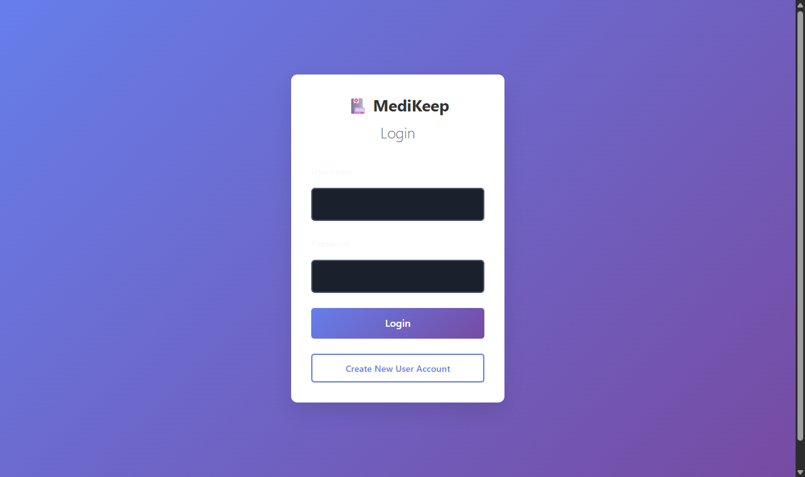
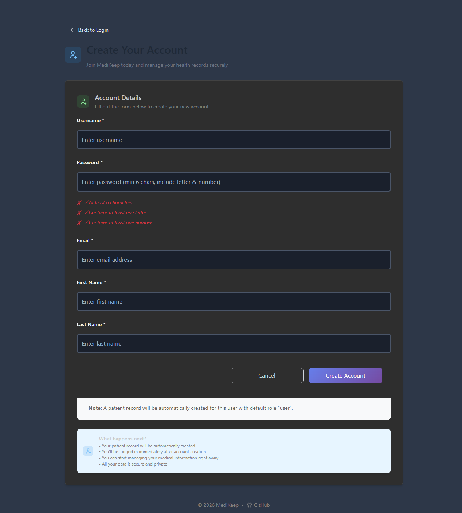

# Getting Started

This section covers the basics of accessing and using MediKeep, including login, registration, and account management.

---

## Login

The login page is the entry point to MediKeep. You must have an account to access the application.

### Login Page Elements

| Element | Description |
|---------|-------------|
| **Username** | Your unique username (case-sensitive) |
| **Password** | Your account password (hidden as you type) |
| **Login Button** | Click to submit your credentials |
| **Create New User Account** | Link to registration page for new users |

### How to Log In

1. Open MediKeep in your web browser
2. You will see the login form with the MediKeep logo
3. Enter your **Username** in the first field
4. Enter your **Password** in the second field
5. Click the **Login** button

### After Successful Login

- You will be redirected to the **Dashboard**
- A green notification will appear: "Login successful!"
- Your session will remain active based on your session timeout setting (default: 24 hours)

### Login Errors

| Error Message | Cause | Solution |
|---------------|-------|----------|
| "HTTP 401: Login failed" | Incorrect username or password | Double-check your credentials and try again |
| "Please log in to access this page" | Session expired or not logged in | Enter your credentials to log in |

### Security Notes

- Your password is never displayed on screen
- After multiple failed attempts, you may need to wait before trying again
- Always log out when using a shared computer

---

## Creating an Account

If you don't have an account, you can create one from the login page.

### How to Access Registration

1. From the login page, click **Create New User Account**
2. You will be taken to the account creation page

### Registration Form Fields

All fields marked with an asterisk (*) are required.

| Field | Required | Description | Example |
|-------|----------|-------------|---------|
| **Username** | Yes | Your unique login name. Cannot be changed later. | johndoe |
| **Password** | Yes | Must meet password requirements (see below) | MyPass123 |
| **Email** | Yes | Your email address for account recovery | john@example.com |
| **First Name** | Yes | Your first/given name | John |
| **Last Name** | Yes | Your last/family name | Doe |

### Step-by-Step Account Creation

1. Click **Create New User Account** from the login page
2. Fill in your desired **Username**
   - Choose something memorable
   - This cannot be changed after account creation
3. Create a **Password** that meets the requirements
   - Watch the checkmarks below the password field turn green
4. Enter your **Email** address
5. Enter your **First Name**
6. Enter your **Last Name**
7. Click **Create Account**

### What Happens After Registration

When you successfully create an account:

- A patient record is automatically created for you
- You are logged in immediately (no need to log in again)
- You are redirected to the Dashboard
- You can start adding your medical information right away

### Registration Notes

- Your account is created with a default "user" role
- All your data is private and secure
- You can update your profile information later (except username)

---

## Password Requirements

When creating an account or changing your password, it must meet these requirements:

| Requirement | Description |
|-------------|-------------|
| **Minimum Length** | At least 6 characters |
| **Contains Letter** | Must include at least one letter (a-z or A-Z) |
| **Contains Number** | Must include at least one number (0-9) |

### Password Strength Indicators

When entering a password, you'll see real-time feedback:

- **Red X** = Requirement not met
- **Green checkmark** = Requirement met

All three indicators must show green checkmarks before you can submit the form.

### Good Password Examples

- `Health123` - Contains letters, numbers, 9 characters
- `MyMeds2024` - Contains letters, numbers, 10 characters
- `Record99` - Contains letters, numbers, 8 characters

### Bad Password Examples

- `12345` - Too short, no letters
- `password` - No numbers
- `abc` - Too short, no numbers

---

## Navigation: Back to Login

If you're on the registration page and want to return to login:

1. Click the **Back to Login** button in the top-left corner
2. You will be returned to the login form

---

## Logging Out

To securely end your session:

### Method 1: From Any Page
1. Click **Profile** in the top navigation menu
2. Click **Logout** from the dropdown menu

### Method 2: From Settings Page
1. Go to **Settings**
2. Click the **Logout** button in the top-right area

### After Logging Out

- You are redirected to the login page
- Your session is ended
- Cached data is cleared from your browser
- You must log in again to access your records

---

[Next: Dashboard](02-dashboard.md) | [Back to Table of Contents](README.md)
