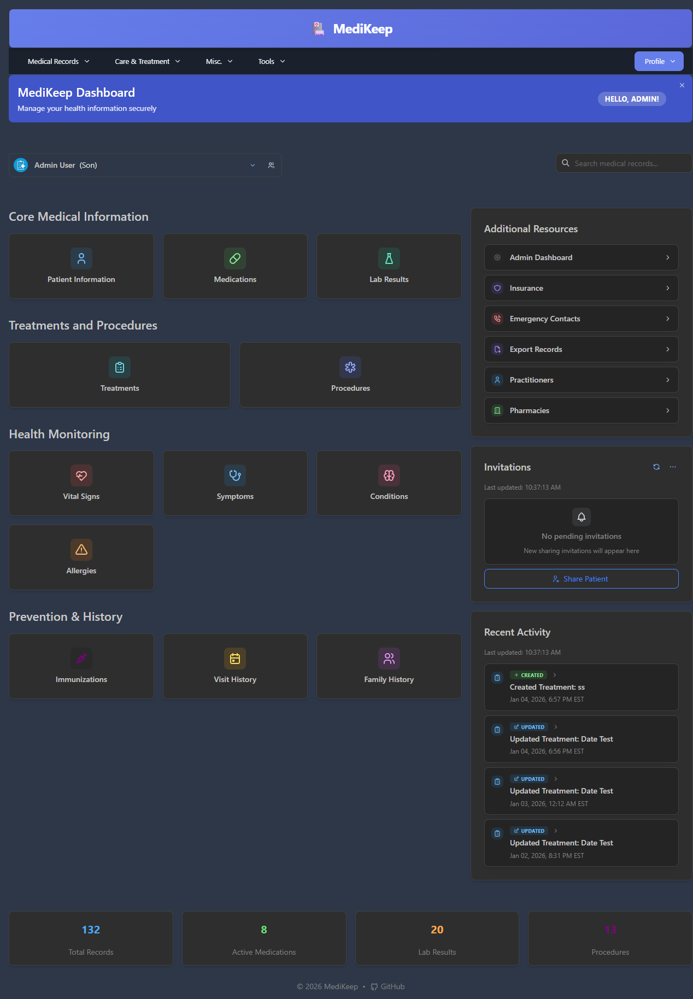
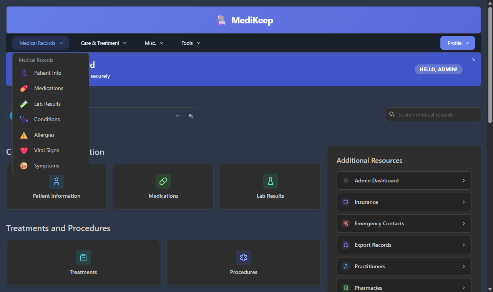
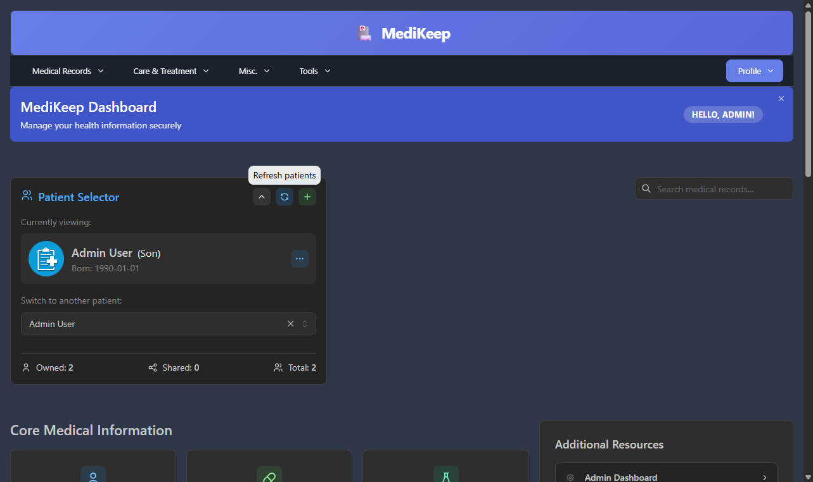

# Dashboard

The Dashboard is your home base in MediKeep. It provides quick access to all your medical information and shows an overview of your health records.



---

## Dashboard Layout

The Dashboard is divided into several sections:

```
+-------------------------------------------------------------+
|  Header: MediKeep Logo + Navigation Menu + Profile          |
+-------------------------------------------------------------+
|  Welcome Banner: "MediKeep Dashboard" + Hello message       |
+-----------------------------------+-------------------------+
|  Patient Selector + Search Bar    |                         |
+-----------------------------------+  Additional Resources   |
|  Core Medical Information         |  Invitations            |
|  Treatments and Procedures        |  Recent Activity        |
|  Health Monitoring                |                         |
|  Prevention & History             |                         |
+-----------------------------------+-------------------------+
|  Statistics Bar: Total Records | Medications | Labs | Proc  |
+-------------------------------------------------------------+
```

---

## Navigation Menu

The top navigation bar provides quick access to all sections of the application.



### Medical Records Menu

Click **Medical Records** to access:

| Menu Item | Description |
|-----------|-------------|
| **Patient Info** | View and edit patient profile information |
| **Medications** | Manage current and past medications |
| **Lab Results** | View laboratory test results and reports |
| **Conditions** | Track medical conditions and diagnoses |
| **Allergies** | Record allergies and sensitivities |
| **Vital Signs** | Log blood pressure, heart rate, temperature, etc. |
| **Symptoms** | Track symptoms and their progression |

### Care & Treatment Menu

Click **Care & Treatment** to access:

| Menu Item | Description |
|-----------|-------------|
| **Treatments** | Manage ongoing treatments and therapies |
| **Procedures** | Record medical procedures and surgeries |
| **Immunizations** | Track vaccinations and immunization records |
| **Visit History** | Log doctor visits and appointments |
| **Family History** | Record family medical history |

### Misc. Menu

Click **Misc.** to access:

| Menu Item | Description |
|-----------|-------------|
| **Practitioners** | Manage your healthcare providers |
| **Pharmacies** | Store pharmacy information |
| **Insurance** | Record insurance policy details |
| **Emergency Contacts** | Manage emergency contact information |

### Tools Menu

Click **Tools** to access:

| Menu Item | Description |
|-----------|-------------|
| **Tag Management** | Organize and manage tags for your records |
| **Custom Reports** | Generate custom health reports |
| **Export Records** | Export your medical data |
| **Settings** | Configure application preferences |

### Profile Menu

Click **Profile** to access:

| Menu Item | Description |
|-----------|-------------|
| **Settings** | Open the settings page |
| **Language** | Change the application language |
| **Theme** | Toggle between light and dark mode |
| **Logout** | Sign out of your account |

---

## Welcome Banner

The welcome banner at the top of the dashboard displays:

- **Title**: "MediKeep Dashboard"
- **Subtitle**: "Manage your health information securely"
- **Greeting**: "Hello, [Your Name]!"
- **Close Button**: Click the X to dismiss the banner

---

## Patient Selector

The Patient Selector allows you to switch between patient profiles if you manage multiple patients.



### Patient Selector Elements

| Element | Description |
|---------|-------------|
| **Current Patient** | Shows name, relationship, and photo |
| **Relationship Tag** | Shows your relationship to the patient (e.g., "Son", "Self") |
| **Dropdown Arrow** | Click to open the patient selector |
| **Switch Patient** | Dropdown to select a different patient |
| **Refresh Button** | Reload the patient list |
| **Add Patient Button** | Create a new patient profile |

### How to Switch Patients

1. Click the **dropdown arrow** next to the current patient name
2. The Patient Selector panel opens showing:
   - Currently viewing patient with photo and birth date
   - "Switch to another patient" dropdown
   - Statistics: Owned, Shared, and Total patients
3. Select a patient from the dropdown list
4. The dashboard updates to show that patient's information

### Patient Statistics

At the bottom of the Patient Selector:

| Stat | Description |
|------|-------------|
| **Owned** | Patients you created and own |
| **Shared** | Patients shared with you by others |
| **Total** | Total number of accessible patients |

---

## Global Search

The search box allows you to search across all your medical records.

### How to Use Search

1. Click the **Search medical records...** text box
2. Type your search query (minimum 2-3 characters)
3. Results appear as you type
4. Click a result to navigate to that record

### Search Tips

- Search by medication name, condition, or practitioner
- Use specific terms for better results
- Search works across all record types

---

## Quick Access Cards

The main dashboard area contains clickable cards organized into categories.

### Core Medical Information

| Card | Description | Click to... |
|------|-------------|-------------|
| **Patient Information** | Basic patient details | View/edit patient profile |
| **Medications** | Current medications | View medication list |
| **Lab Results** | Test results | View lab results |

### Treatments and Procedures

| Card | Description | Click to... |
|------|-------------|-------------|
| **Treatments** | Ongoing treatments | View treatment list |
| **Procedures** | Medical procedures | View procedure history |

### Health Monitoring

| Card | Description | Click to... |
|------|-------------|-------------|
| **Vital Signs** | BP, heart rate, etc. | Log or view vitals |
| **Symptoms** | Symptom tracking | View/add symptoms |
| **Conditions** | Medical conditions | View conditions |
| **Allergies** | Allergy records | View allergies |

### Prevention & History

| Card | Description | Click to... |
|------|-------------|-------------|
| **Immunizations** | Vaccination records | View immunizations |
| **Visit History** | Doctor visits | View visit log |
| **Family History** | Family medical history | View family history |

---

## Additional Resources Sidebar

The right sidebar provides quick access to additional features.

### Resource Links

| Link | Description |
|------|-------------|
| **Admin Dashboard** | Access admin features (admin users only) |
| **Insurance** | View insurance information |
| **Emergency Contacts** | View emergency contacts |
| **Export Records** | Export your medical data |
| **Practitioners** | View healthcare providers |
| **Pharmacies** | View pharmacy information |

### Invitations Panel

Shows pending patient sharing invitations.

| Element | Description |
|---------|-------------|
| **Refresh Button** | Reload invitations |
| **Last Updated** | When invitations were last checked |
| **Invitation List** | Pending invitations (if any) |
| **Share Patient** | Button to share a patient with another user |

### How to Share a Patient

1. Click the **Share Patient** button
2. Enter the email or username of the person to share with
3. Select the patient to share
4. Choose permission level
5. Click **Send Invitation**

### Recent Activity Panel

Shows your latest actions in the application.

| Element | Description |
|---------|-------------|
| **Last Updated** | When activity was last refreshed |
| **Activity List** | Recent creates, updates, and deletes |
| **Activity Type** | Badge showing Created/Updated/Deleted |
| **Description** | What was changed |
| **Timestamp** | When the action occurred |

Each activity item shows:
- **Icon**: Visual indicator of the record type
- **Action Badge**: Green "Created", Blue "Updated", or Red "Deleted"
- **Description**: e.g., "Updated Treatment: Physical Therapy"
- **Date/Time**: When the action occurred with timezone

---

## Statistics Bar

At the bottom of the dashboard, a statistics bar shows summary counts.

| Statistic | Description |
|-----------|-------------|
| **Total Records** | Total number of medical records |
| **Active Medications** | Number of currently active medications |
| **Lab Results** | Total number of lab result records |
| **Procedures** | Total number of procedure records |

These numbers update automatically when you add or modify records.

---

## Keyboard Shortcuts

| Shortcut | Action |
|----------|--------|
| **Alt + T** | Open notifications panel |
| **Escape** | Close open menus or dialogs |

---

## Tips for Using the Dashboard

1. **Start with Patient Info**: Make sure your patient profile is complete
2. **Use the Search**: Quickly find any record using global search
3. **Check Recent Activity**: See what you've recently added or modified
4. **Review Statistics**: Get a quick overview of your records count
5. **Explore Menus**: Use dropdown menus for organized navigation

---

[Previous: Getting Started](01-getting-started.md) | [Next: Patient Information](03-patient-information.md) | [Back to Table of Contents](README.md)
