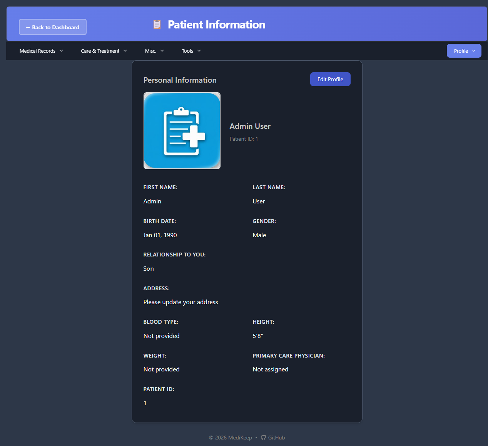

# Patient Information

The Patient Information page displays and manages the core profile data for a patient. This includes personal details, contact information, and basic medical information.



---

## Accessing Patient Information

There are multiple ways to access the Patient Information page:

1. **From Dashboard**: Click the **Patient Information** card
2. **From Menu**: Click **Medical Records** > **Patient Info**
3. **Direct URL**: Navigate to `/patients/me`

---

## Page Layout

The Patient Information page displays:

```
+-------------------------------------------------------------+
|  Header: <- Back to Dashboard | Patient Information         |
+-------------------------------------------------------------+
|  Navigation Menu                                            |
+-------------------------------------------------------------+
|                                                             |
|  +-----------------------------------------------------+   |
|  |  Personal Information            [Edit Profile]      |   |
|  |                                                      |   |
|  |  [Photo]    Patient Name                            |   |
|  |             Patient ID: X                           |   |
|  |                                                      |   |
|  |  First Name: ____    Last Name: ____                |   |
|  |  Birth Date: ____    Gender: ____                   |   |
|  |  Relationship: ____                                 |   |
|  |  Address: ____                                      |   |
|  |  Blood Type: ____    Height: ____                   |   |
|  |  Weight: ____        Primary Physician: ____        |   |
|  |  Patient ID: ____                                   |   |
|  +-----------------------------------------------------+   |
|                                                             |
+-------------------------------------------------------------+
```

---

## Viewing Patient Information

### Information Fields Displayed

| Field | Description | Example |
|-------|-------------|---------|
| **Photo** | Patient's profile photo (or placeholder icon) | - |
| **Patient Name** | Full name displayed prominently | Admin User |
| **Patient ID** | Unique identifier in the system | 1 |
| **First Name** | Patient's first/given name | Admin |
| **Last Name** | Patient's last/family name | User |
| **Birth Date** | Date of birth (formatted) | Jan 01, 1990 |
| **Gender** | Patient's gender | Male, Female, Other |
| **Relationship to You** | How the patient relates to the account owner | Self, Son, Daughter, Parent, Spouse, Other |
| **Address** | Full mailing address | 123 Main St, City, State |
| **Blood Type** | Blood type for emergencies | A+, A-, B+, B-, AB+, AB-, O+, O- |
| **Height** | Patient's height | 5'8" (imperial) or cm (metric) |
| **Weight** | Patient's weight | 150 lbs (imperial) or kg (metric) |
| **Primary Care Physician** | Assigned primary doctor | Dr. Sarah Wilson |

### Field States

- **"Not provided"**: Optional field that hasn't been filled in
- **"Not assigned"**: No practitioner has been linked
- **"Please update your address"**: Address needs to be entered

---

## Editing Patient Information

### How to Edit

1. Navigate to the Patient Information page
2. Click the **Edit Profile** button (top-right of the card)
3. A modal dialog opens with the edit form
4. Make your changes
5. Click **Save Changes** to save, or **Cancel** to discard

### Edit Form Fields

The edit form contains the following fields:

#### Photo Section

| Element | Description |
|---------|-------------|
| **Photo Preview** | Shows current photo or placeholder |
| **Choose Photo** | Button to upload a new photo |
| **Remove Photo** | Button to delete the current photo |
| **Format Info** | "Accepts JPEG, PNG, GIF, or BMP images" |
| **Size Limit** | Maximum file size: 15MB |
| **Note** | "Photos are automatically resized and optimized" |

#### Personal Information Fields

| Field | Required | Type | Description |
|-------|----------|------|-------------|
| **First Name** | Yes (*) | Text | Patient's first name |
| **Last Name** | Yes (*) | Text | Patient's last name |
| **Birth Date** | Yes (*) | Date Picker | Patient's date of birth |
| **Gender** | No | Dropdown | Male, Female, Other, Prefer not to say |
| **Relationship to You** | No | Dropdown | How patient relates to you |
| **Address** | No | Text | Full address |

#### Medical Information Fields

| Field | Required | Type | Description |
|-------|----------|------|-------------|
| **Blood Type** | No | Dropdown | A+, A-, B+, B-, AB+, AB-, O+, O- |
| **Height** | No | Number | Height (unit based on settings) |
| **Weight** | No | Number | Weight (unit based on settings) |
| **Primary Care Physician** | No | Dropdown | Select from your practitioners list |

### Form Buttons

| Button | Action |
|--------|--------|
| **Cancel** | Close the form without saving changes |
| **Save Changes** | Save all changes and close the form |

---

## Uploading a Patient Photo

### Supported Formats

- JPEG (.jpg, .jpeg)
- PNG (.png)
- GIF (.gif)
- BMP (.bmp)

### Photo Requirements

| Requirement | Value |
|-------------|-------|
| **Maximum File Size** | 15 MB |
| **Recommended Size** | Square images work best |
| **Auto-Processing** | Photos are automatically resized and optimized |

### How to Upload a Photo

1. Click **Edit Profile** on the Patient Information page
2. In the Photo section, click **Choose Photo**
3. Select an image file from your computer
4. The preview will update to show the new photo
5. Click **Save Changes** to keep the new photo

### How to Remove a Photo

1. Click **Edit Profile** on the Patient Information page
2. Click **Remove Photo** (red button)
3. The photo will be replaced with the default placeholder
4. Click **Save Changes** to confirm removal

---

## Understanding Unit Settings

Height and weight display depends on your unit system preference in Settings:

| Setting | Height Display | Weight Display |
|---------|---------------|----------------|
| **Imperial** | Feet and inches (e.g., 5'8") | Pounds (e.g., 150 lbs) |
| **Metric** | Centimeters (e.g., 173 cm) | Kilograms (e.g., 68 kg) |

To change unit settings:
1. Go to **Settings** (Profile > Settings or Tools > Settings)
2. Find **Unit System** under Application Preferences
3. Select Imperial or Metric
4. Click **Save All Changes**

---

## Assigning a Primary Care Physician

The Primary Care Physician field links to your Practitioners list.

### To Assign a Physician

1. First, ensure you have practitioners added (go to **Misc.** > **Practitioners**)
2. Open the Patient Information edit form
3. Click the **Primary Care Physician** dropdown
4. Select from your list of practitioners
5. Click **Save Changes**

### If No Practitioners Available

If the dropdown is empty:
1. Go to **Misc.** > **Practitioners**
2. Add your healthcare providers
3. Return to Patient Information to assign one

---

## Tips for Patient Information

1. **Keep information current**: Update address and contact info when they change
2. **Add a photo**: Makes it easier to identify patients in multi-patient accounts
3. **Enter blood type**: Critical information for emergencies
4. **Link a physician**: Helps track who manages the patient's primary care
5. **Complete all fields**: More complete profiles are more useful for medical records

---

## Common Issues

### "Photo upload failed"

- Check file size (must be under 15MB)
- Verify file format (JPEG, PNG, GIF, or BMP only)
- Try a different image file

### "Cannot save changes"

- Ensure required fields (marked with *) are filled
- Check for validation errors highlighted in red
- Verify you have a stable internet connection

### Height/Weight showing wrong units

- Go to Settings and check your Unit System preference
- Change to Imperial or Metric as desired
- Save changes and return to Patient Information

---

[Previous: Dashboard](02-dashboard.md) | [Next: Medications](04-medications.md) | [Back to Table of Contents](README.md)
