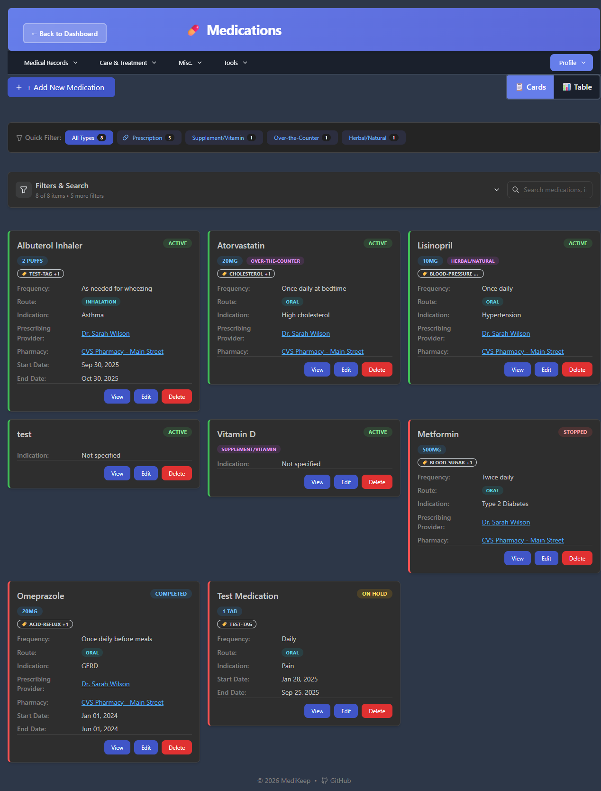
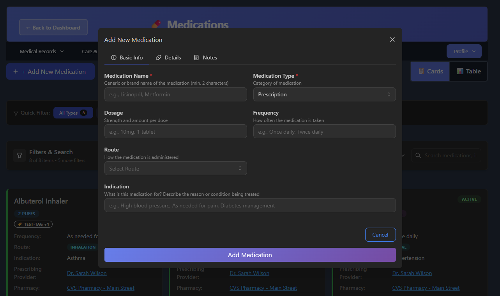

# Medications

The Medications page allows you to track all medications, supplements, and over-the-counter drugs. You can view, add, edit, and organize medications with powerful filtering and search capabilities.



---

## Accessing Medications

There are multiple ways to access the Medications page:

1. **From Dashboard**: Click the **Medications** card
2. **From Menu**: Click **Medical Records** > **Medications**
3. **Direct URL**: Navigate to `/medications`

---

## Page Layout

The Medications page provides two view modes and extensive filtering options:

```
+-------------------------------------------------------------+
|  Header: <- Back to Dashboard | Medications                 |
+-------------------------------------------------------------+
|  Navigation Menu                                            |
+-------------------------------------------------------------+
|  [+ Add New Medication]              [Cards] [Table] [Print]|
+-------------------------------------------------------------+
|  Quick Filter: All Types | Prescription | Supplement | OTC  |
+-------------------------------------------------------------+
|  Filters & Search: [Search box...]                          |
|  Advanced Filters: Status | Type | Route | Date | Sort      |
+-------------------------------------------------------------+
|                                                             |
|  Medication Cards or Table View                             |
|                                                             |
+-------------------------------------------------------------+
```

---

## View Modes

### Cards View

The default view displays medications as individual cards showing detailed information at a glance.

Each card displays:

| Element | Description |
|---------|-------------|
| **Medication Name** | Name of the medication (e.g., "Lisinopril") |
| **Dosage** | Strength/amount (e.g., "10mg", "2 puffs") |
| **Type Badge** | Category label (e.g., "Prescription", "Supplement/Vitamin") |
| **Tags** | Organizational tags with tag icon |
| **Status Badge** | Current status (Active, Stopped, Completed, On Hold) |
| **Frequency** | How often taken (e.g., "Once daily", "As needed") |
| **Route** | Administration method (e.g., "oral", "inhalation") |
| **Indication** | What the medication is for |
| **Prescribing Provider** | Doctor who prescribed it (clickable) |
| **Pharmacy** | Where medication is filled (clickable) |
| **Start Date** | When medication was started |
| **End Date** | When medication ended (if applicable) |
| **Action Buttons** | View, Edit, Delete |

### Table View

Click **Table** to switch to a compact tabular view ideal for reviewing many medications.

Table columns:

| Column | Description |
|--------|-------------|
| **Medication Name** | Name of the medication |
| **Type** | Prescription, OTC, Supplement, etc. |
| **Dosage** | Strength and amount |
| **Frequency** | How often taken |
| **Route** | How administered |
| **Purpose** | Indication/reason |
| **Prescriber** | Prescribing provider |
| **Pharmacy** | Filling pharmacy |
| **Start Date** | When started |
| **End Date** | When ended |
| **Status** | Current status |

Each column header is sortable by clicking on it.

### Print View

In Table view, a **Print** button appears allowing you to print or save the medication list as a PDF.

---

## Quick Filters

Quick filter buttons allow fast filtering by medication type:

| Filter | Description |
|--------|-------------|
| **All Types** | Shows all medications (default) |
| **Prescription** | Only prescription medications |
| **Supplement/Vitamin** | Supplements and vitamins |
| **Over-the-Counter** | OTC medications |
| **Herbal/Natural** | Herbal and natural remedies |

Each button shows the count of medications in that category.

---

## Search and Advanced Filters

### Search Box

The search box searches across:
- Medication names
- Indications/purposes
- Dosages
- Tags

Type at least 2-3 characters to start searching.

### Advanced Filters Panel

Click the expand arrow next to "Filters & Search" to reveal advanced options:

| Filter | Options |
|--------|---------|
| **Status** | All Statuses, Active, Completed, Stopped, On Hold |
| **Medication Type** | All Types, Prescription, Supplement, OTC, Herbal |
| **Route (Category)** | All Routes, Oral, Inhalation, Injection, Topical, etc. |
| **Date Range** | All Time Periods, Last 30 days, Last 6 months, Last year, Custom |
| **Sort By** | Status (Active First), Name, Start Date, End Date |
| **Sort Direction** | A-Z or Z-A toggle button |

The filter indicator shows how many items match: "8 of 8 items"

---

## Adding a New Medication

### How to Add

1. Click **+ Add New Medication** button
2. A dialog opens with three tabs: **Basic Info**, **Details**, **Notes**
3. Fill in the required fields (marked with *)
4. Click **Add Medication** to save



### Basic Info Tab

| Field | Required | Description | Example |
|-------|----------|-------------|---------|
| **Medication Name** | Yes (*) | Generic or brand name (min. 2 characters) | Lisinopril, Metformin |
| **Medication Type** | Yes (*) | Category of medication | Prescription (default) |
| **Dosage** | No | Strength and amount per dose | 10mg, 1 tablet |
| **Frequency** | No | How often taken | Once daily, Twice daily |
| **Route** | No | How administered | oral, inhalation |
| **Indication** | No | What the medication treats | High blood pressure |

### Medication Type Options

| Type | Description |
|------|-------------|
| **Prescription** | Requires a doctor's prescription |
| **Supplement/Vitamin** | Nutritional supplements |
| **Over-the-Counter** | Available without prescription |
| **Herbal/Natural** | Natural or herbal remedies |

### Route Options

Common administration routes include:
- **oral** - Taken by mouth
- **inhalation** - Breathed in
- **injection** - Injected
- **topical** - Applied to skin
- **sublingual** - Under the tongue
- **rectal** - Rectal administration
- **ophthalmic** - Eye drops

### Details Tab

| Field | Description |
|-------|-------------|
| **Status** | Current status (default: Active) |
| **Start Date** | When the medication was started |
| **End Date** | When the medication ended (if applicable) |
| **Prescribing Provider** | Select from your practitioners list |
| **Pharmacy** | Select from your pharmacies list |
| **Tags** | Add tags for organization (up to 15 tags) |

### Status Options

| Status | Description | When to Use |
|--------|-------------|-------------|
| **Active** | Currently taking | Medications you're currently on |
| **Stopped** | Discontinued | Medications you stopped taking |
| **Completed** | Finished course | Completed medication courses (e.g., antibiotics) |
| **On Hold** | Temporarily paused | Medications temporarily suspended |

### Notes Tab

The Notes tab is reserved for future functionality to add detailed notes about the medication.

---

## Viewing Medication Details

To view full details of a medication:

1. Find the medication card
2. Click the **View** button
3. A read-only view opens showing all information

---

## Editing a Medication

### How to Edit

1. Find the medication you want to edit
2. Click the **Edit** button on the card
3. The edit dialog opens with current values filled in
4. Make your changes
5. Click **Save Changes**

### Editable Fields

All fields that were available when adding the medication can be edited:
- Name, Type, Dosage, Frequency, Route
- Indication, Status, Dates
- Provider, Pharmacy, Tags

---

## Deleting a Medication

### How to Delete

1. Find the medication to delete
2. Click the **Delete** button
3. Confirm the deletion when prompted
4. The medication is removed from your records

**Note**: Deletion is permanent. Consider changing the status to "Stopped" or "Completed" instead to keep historical records.

---

## Working with Providers and Pharmacies

### Linking a Prescribing Provider

Medications can be linked to practitioners (doctors) in your system:

1. Ensure you have practitioners added (**Misc.** > **Practitioners**)
2. When adding/editing a medication, select from the **Prescribing Provider** dropdown
3. Clicking a provider name in the medication card opens their details

### Linking a Pharmacy

Medications can be linked to pharmacies in your system:

1. Ensure you have pharmacies added (**Misc.** > **Pharmacies**)
2. When adding/editing a medication, select from the **Pharmacy** dropdown
3. Clicking a pharmacy name in the medication card opens their details

---

## Using Tags

Tags help organize and quickly find medications:

### Adding Tags

1. In the edit form, go to the **Details** tab
2. Type a tag name in the Tags field
3. Press **Enter** to add the tag
4. You can add up to 15 tags per medication

### Tag Examples

- `blood-pressure` - Blood pressure medications
- `cholesterol` - Cholesterol management
- `pain` - Pain medications
- `daily` - Daily medications
- `as-needed` - PRN medications

### Searching by Tag

Type a tag name in the search box to find all medications with that tag.

---

## Tips for Managing Medications

1. **Keep records current**: Update status when you start or stop medications
2. **Use descriptive indications**: Helps remember why each medication was prescribed
3. **Link providers**: Easily see which doctor prescribed each medication
4. **Link pharmacies**: Track where each medication is filled
5. **Use tags**: Create a tagging system that works for you
6. **Add start dates**: Track medication history over time
7. **Update end dates**: Mark when you stop a medication
8. **Use Table view**: For reviewing multiple medications at once
9. **Print for appointments**: Print your medication list for doctor visits

---

## Common Issues

### "Cannot add medication"

- Ensure the medication name is at least 2 characters
- Check that required fields (marked with *) are filled
- Verify you have a stable internet connection

### "Provider/Pharmacy dropdown is empty"

- Add practitioners first: **Misc.** > **Practitioners**
- Add pharmacies first: **Misc.** > **Pharmacies**
- Then return to add/edit the medication

### "Can't find a medication"

- Clear all filters by clicking "All Types" in Quick Filters
- Check the Status filter (may be filtering out stopped/completed)
- Try searching by part of the medication name
- Ensure you're viewing the correct patient

### "Status stuck on Active"

- Click **Edit** on the medication
- Go to the **Details** tab
- Change the Status dropdown to the appropriate value
- Click **Save Changes**

---

[Previous: Patient Information](03-patient-information.md) | [Next: Lab Results](05-lab-results.md) | [Back to Table of Contents](README.md)
