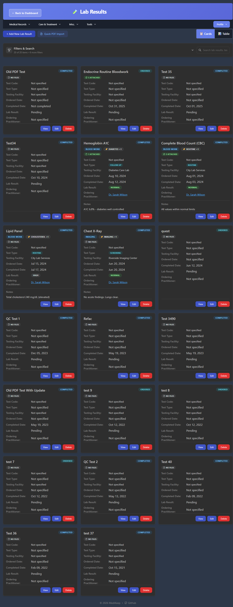
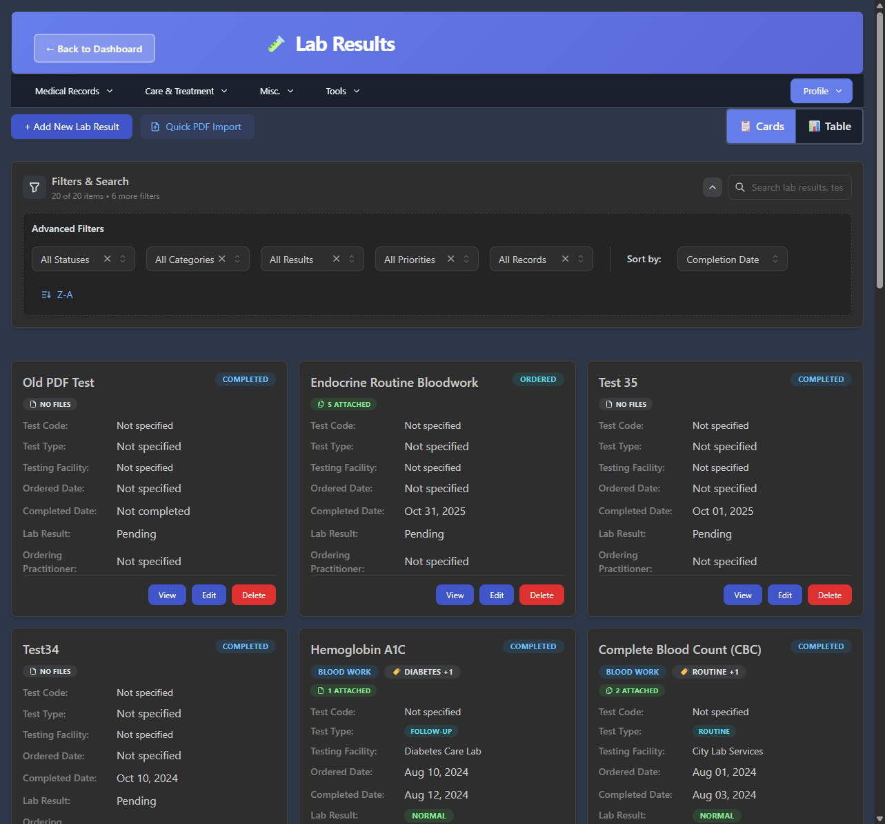

# Lab Results

The Lab Results page allows you to track laboratory tests, diagnostic imaging, and other medical tests. You can store test results, attach documents (including PDF reports), and organize everything with tags and notes.



---

## Accessing Lab Results

There are multiple ways to access the Lab Results page:

1. **From Dashboard**: Click the **Lab Results** card
2. **From Menu**: Click **Medical Records** > **Lab Results**
3. **Direct URL**: Navigate to `/lab-results`

---

## Page Layout

The Lab Results page provides comprehensive test management with document attachment capabilities:

```
+-------------------------------------------------------------+
|  Header: <- Back to Dashboard | Lab Results                 |
+-------------------------------------------------------------+
|  Navigation Menu                                            |
+-------------------------------------------------------------+
|  [+ Add New Lab Result] [Quick PDF Import]    [Cards] [Table]|
+-------------------------------------------------------------+
|  Filters & Search: [Search box...]                          |
|  20 of 20 items - 6 more filters                            |
+-------------------------------------------------------------+
|                                                             |
|  Lab Result Cards or Table View                             |
|                                                             |
+-------------------------------------------------------------+
```

---

## View Modes

### Cards View

The default view displays lab results as individual cards showing detailed information.

Each card displays:

| Element | Description |
|---------|-------------|
| **Test Name** | Name of the lab test (e.g., "Complete Blood Count") |
| **File Indicator** | Shows attached files count or "No files" |
| **Status Badge** | Current status (Ordered, In Progress, Completed, Cancelled) |
| **Test Code** | Lab code or LOINC identifier |
| **Test Type** | Priority/urgency (routine, follow-up, screening, urgent) |
| **Testing Facility** | Where the test was performed |
| **Ordered Date** | When the test was requested |
| **Completed Date** | When results were finalized |
| **Lab Result** | Result classification (Normal, high, low, Pending) |
| **Ordering Practitioner** | Doctor who ordered the test (clickable) |
| **Category Badge** | Test category (blood work, imaging, etc.) |
| **Tags** | Organizational tags |
| **Notes** | Additional clinical notes (if any) |
| **Action Buttons** | View, Edit, Delete |

### Table View

Click **Table** to switch to a compact tabular view for reviewing multiple results.

---

## Search and Filters

### Search Box

The search box searches across:
- Test names
- Test codes
- Testing facilities
- Practitioners
- Tags

### Advanced Filters

Click the expand button next to "Filters & Search" to access additional filtering options including status, date range, and test type filters.



The advanced filters allow you to filter by:
- **Status**: All Statuses, Ordered, In Progress, Completed, Cancelled
- **Category**: All Categories, blood work, imaging, etc.
- **Results**: All Results, Normal, high, low, critical, Pending
- **Priority**: All Priorities, routine, follow-up, screening, urgent
- **Files**: All Records, With Files, Without Files
- **Sort by**: Completion Date, Name, Ordered Date, etc.

---

## Adding a New Lab Result

### How to Add

1. Click **+ Add New Lab Result** button
2. Fill in the test information
3. Optionally attach files
4. Click **Add New Lab Result** to save

### Form Fields

| Field | Required | Description | Example |
|-------|----------|-------------|---------|
| **Test Name** | Yes (*) | Name or description of the test | Complete Blood Count (CBC) |
| **Test Code** | No | Lab code or LOINC identifier | CBC, 85025 |
| **Test Category** | No | Type of laboratory test | Blood work, Imaging |
| **Test Type** | No | Priority or urgency level | routine, follow-up, screening, urgent |
| **Testing Facility** | No | Where the test is performed | Main Hospital Laboratory |
| **Ordering Practitioner** | No | Doctor who ordered the test | Select from list |
| **Test Status** | No | Current status of the test | Default: Ordered |
| **Lab Result** | No | Result classification | Normal, high, low, critical |
| **Ordered Date** | No | When the test was requested | Date picker |
| **Completed Date** | No | When results were available | Date picker |
| **Additional Notes** | No | Clinical notes or observations | Free text |
| **Tags** | No | Organizational tags (up to 15) | diabetes, routine |

### Test Status Options

| Status | Description |
|--------|-------------|
| **Ordered** | Test has been requested (default) |
| **In Progress** | Sample is being processed |
| **Completed** | Results are available |
| **Cancelled** | Test was cancelled |

### Lab Result Options

| Result | Description |
|--------|-------------|
| **Pending** | Results not yet available |
| **Normal** | Within normal range |
| **high** | Above normal range |
| **low** | Below normal range |
| **critical** | Requires immediate attention |

---

## Quick PDF Import

The **Quick PDF Import** button provides a streamlined way to import lab result PDFs directly. This is useful when you have PDF reports from labs and want to quickly add them to your records.

---

## Attaching Files

Lab results support comprehensive document management with file attachments.

### Storage Options

| Storage | Description |
|---------|-------------|
| **Local Storage** | Files stored on the MediKeep server |
| **Paperless-ngx** | Integration with Paperless-ngx document management system |

### Supported File Types

The following file formats are accepted:

**Documents:**
- PDF (.pdf)
- Text (.txt)
- CSV (.csv)
- XML (.xml)
- JSON (.json)
- Word (.doc, .docx)
- Excel (.xls, .xlsx)

**Images:**
- JPEG (.jpg, .jpeg)
- PNG (.png)
- TIFF (.tiff)
- BMP (.bmp)
- GIF (.gif)
- DICOM (.dcm) - medical imaging

**Archives:**
- ZIP (.zip)
- ISO (.iso)
- 7-Zip (.7z)
- RAR (.rar)

**Media:**
- Video (.avi, .mp4, .mov, .webm)
- Audio (.mp3, .wav, .m4a)

**Medical/3D:**
- STL (.stl)
- NIfTI (.nii)
- NRRD (.nrrd)

### File Size Limit

Maximum file size: **1024 MB** (1 GB)

### How to Attach Files

1. In the Add/Edit form, scroll to the **Add Files** section
2. Select storage backend (Local Storage or Paperless-ngx)
3. Click **Choose Files** or drag and drop files
4. Files will be uploaded when you save the lab result

### Viewing Attached Files

- Cards show file attachment count (e.g., "5 attached")
- Click the file indicator to view attached files
- Files can be downloaded or viewed depending on type

---

## Working with Paperless-ngx Integration

If you have Paperless-ngx configured, you can:

1. Store documents in your Paperless-ngx instance
2. Enable auto-sync to automatically import new documents
3. Benefits include OCR, full-text search, and advanced document management

To configure Paperless-ngx:
1. Go to **Settings**
2. Find the Paperless-ngx section
3. Enter your Paperless-ngx URL and credentials
4. Test the connection

---

## Viewing Lab Result Details

To view full details of a lab result:

1. Find the lab result card
2. Click the **View** button
3. A detailed view opens showing all information and attached files

---

## Editing a Lab Result

### How to Edit

1. Find the lab result you want to edit
2. Click the **Edit** button
3. Make your changes
4. Click **Save Changes**

You can update any field and add or remove file attachments.

---

## Deleting a Lab Result

### How to Delete

1. Find the lab result to delete
2. Click the **Delete** button
3. Confirm the deletion when prompted

**Note**: Deleting a lab result also removes its attached files. This action is permanent.

---

## Tips for Managing Lab Results

1. **Use descriptive names**: Include the test type in the name (e.g., "CBC - Annual Physical 2024")
2. **Attach PDF reports**: Keep original lab reports attached for reference
3. **Add notes**: Record significant findings or doctor's comments
4. **Use tags consistently**: Create a tagging system (e.g., "routine", "follow-up", "abnormal")
5. **Track ordered tests**: Add tests when ordered, update when results arrive
6. **Link practitioners**: Associate tests with the ordering physician
7. **Note facilities**: Record which lab performed each test
8. **Update status**: Keep status current as tests progress

---

## Common Lab Result Examples

| Test Type | Category | Common Tags |
|-----------|----------|-------------|
| Complete Blood Count (CBC) | blood work | routine, annual |
| Lipid Panel | blood work | cholesterol, heart |
| Hemoglobin A1C | blood work | diabetes |
| Thyroid Panel (TSH, T3, T4) | blood work | thyroid |
| Metabolic Panel (BMP/CMP) | blood work | kidney, liver |
| Chest X-Ray | imaging | screening, respiratory |
| MRI | imaging | diagnostic |
| CT Scan | imaging | diagnostic |
| Urinalysis | lab | routine, UTI |
| ECG/EKG | diagnostic | heart, cardiac |

---

## Common Issues

### "Cannot add lab result"

- Ensure the test name is filled in (required field)
- Verify you have a stable internet connection

### "File upload failed"

- Check file size (must be under 1024 MB)
- Verify file type is in the supported formats list
- Try a different file or format

### "Paperless-ngx connection failed"

- Go to Settings and verify Paperless-ngx configuration
- Check that the URL and credentials are correct
- Ensure Paperless-ngx server is accessible

### "Can't find a lab result"

- Clear filters to show all results
- Check the status filter (may be filtering by status)
- Try searching by part of the test name
- Ensure you're viewing the correct patient

---

[Previous: Medications](04-medications.md) | [Next: Settings](06-settings.md) | [Back to Table of Contents](README.md)
