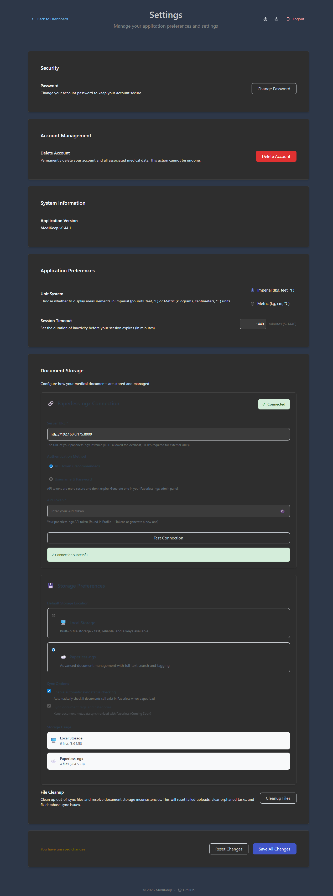

# Settings

The Settings page allows you to customize your MediKeep experience, manage security settings, configure document storage, and control application preferences.



---

## Accessing Settings

There are multiple ways to access the Settings page:

1. **From Menu**: Click **Tools** > **Settings**
2. **From Profile Menu**: Click **Profile** > **Settings**
3. **Direct URL**: Navigate to `/settings`

---

## Page Layout

The Settings page is organized into logical sections:

```
+-------------------------------------------------------------+
|  Header: Back to Dashboard | Settings | Theme | Logout      |
+-------------------------------------------------------------+
|                                                             |
|  Security                                                   |
|  +- Password                                                |
|                                                             |
|  Account Management                                         |
|  +- Delete Account                                          |
|                                                             |
|  System Information                                         |
|  +- Application Version                                     |
|                                                             |
|  Application Preferences                                    |
|  +- Unit System                                             |
|  +- Session Timeout                                         |
|                                                             |
|  Document Storage                                           |
|  +- Paperless-ngx Connection                                |
|  +- Storage Preferences                                     |
|  +- Sync Options                                            |
|  +- Storage Usage                                           |
|  +- File Cleanup                                            |
|                                                             |
+-------------------------------------------------------------+
|  [Reset Changes] [Save All Changes]                         |
+-------------------------------------------------------------+
```

---

## Header Controls

The Settings header provides quick access to common actions:

| Control | Description |
|---------|-------------|
| **Back to Dashboard** | Return to the main dashboard |
| **Settings** | Reload settings page |
| **Theme Toggle** | Switch between light and dark mode |
| **Logout** | Sign out of your account |

---

## Security

### Password

Change your account password to maintain security.

| Element | Description |
|---------|-------------|
| **Change Password Button** | Opens dialog to change your password |

### How to Change Your Password

1. Click **Change Password**
2. Enter your current password
3. Enter your new password (must meet requirements)
4. Confirm your new password
5. Click **Save** or **Update Password**

Password requirements:
- Minimum 6 characters
- Must contain at least one letter
- Must contain at least one number

---

## Account Management

### Delete Account

Permanently delete your account and all associated medical data.

| Element | Description |
|---------|-------------|
| **Delete Account Button** | Initiates account deletion process |

**Warning**: This action is permanent and cannot be undone. All your medical records, patient data, and uploaded files will be permanently deleted.

### How to Delete Your Account

1. Click **Delete Account**
2. Read the warning message carefully
3. Type confirmation text if required
4. Click **Confirm Delete** or **Delete Permanently**

---

## System Information

### Application Version

Displays the current version of MediKeep.

| Information | Description |
|-------------|-------------|
| **MediKeep vX.X.X** | Current application version number |

This information is useful when:
- Reporting issues
- Checking for updates
- Verifying deployment

---

## Application Preferences

### Unit System

Choose how measurements are displayed throughout the application.

| Option | Description | Examples |
|--------|-------------|----------|
| **Imperial** | US customary units | pounds (lbs), feet/inches, Fahrenheit |
| **Metric** | International system | kilograms (kg), centimeters (cm), Celsius |

### How to Change Unit System

1. Select either **Imperial** or **Metric**
2. Click **Save All Changes**
3. All measurements will be displayed in your chosen unit system

This affects:
- Patient height and weight display
- Vital signs (temperature, etc.)
- Any measurement fields in forms

### Session Timeout

Set how long you can be inactive before being automatically logged out.

| Setting | Description |
|---------|-------------|
| **Session Timeout** | Duration in minutes (5-1440) |

**Default**: 1440 minutes (24 hours)

### How to Change Session Timeout

1. Enter a value between 5 and 1440 in the text field
2. Click **Save All Changes**
3. Your session will now expire after the specified period of inactivity

**Tips**:
- Use shorter timeouts (30-60 minutes) on shared computers
- Use longer timeouts (1440 minutes) on personal devices
- The session extends each time you interact with the application

---

## Document Storage

Configure how medical documents are stored and managed.

### Paperless-ngx Connection

Paperless-ngx is an open-source document management system that provides advanced features like OCR, full-text search, and automatic tagging.

#### Connection Settings

| Field | Required | Description |
|-------|----------|-------------|
| **Server URL** | Yes | URL of your Paperless-ngx instance |
| **Authentication Method** | Yes | API Token (recommended) or Username & Password |
| **API Token** | Depends | Your Paperless-ngx API token |

#### How to Connect Paperless-ngx

1. Enter your Paperless-ngx **Server URL**
   - Example: `https://paperless.example.com` or `http://192.168.0.175:8000`
   - HTTP is allowed for localhost/local network
   - HTTPS is required for external URLs
2. Select **Authentication Method**
   - API Token is recommended (more secure, doesn't expire)
3. Enter your **API Token**
   - Find it in Paperless-ngx: Profile > Tokens
   - Or generate a new one in the admin panel
4. Click **Test Connection**
5. If successful, click **Save All Changes**

#### Connection Status

| Status | Description |
|--------|-------------|
| **Connected** | Successfully connected to Paperless-ngx |
| **Not Connected** | No valid connection configured |
| **Connection Failed** | Unable to connect (check URL and credentials) |

### Storage Preferences

#### Default Storage Location

Choose where new documents are stored by default:

| Option | Description |
|--------|-------------|
| **Local Storage** | Built-in file storage - fast, reliable, always available |
| **Paperless-ngx** | Advanced document management with full-text search and tagging |

### Sync Options

| Option | Description |
|--------|-------------|
| **Enable automatic sync status checking** | Automatically verify documents exist in Paperless when pages load |
| **Sync document tags and categories** | Keep metadata synchronized (Coming Soon) |

### Storage Usage

Displays current storage utilization:

| Location | Information |
|----------|-------------|
| **Local Storage** | Number of files and total size |
| **Paperless-ngx** | Number of files and total size |

### File Cleanup

Clean up storage inconsistencies and resolve document issues.

| Element | Description |
|---------|-------------|
| **Cleanup Files Button** | Resets failed uploads, clears orphaned tasks, fixes sync issues |

Use File Cleanup when:
- Uploads have failed or are stuck
- Document counts seem incorrect
- Sync status is inconsistent

---

## Saving Changes

Settings changes are not saved automatically. You must explicitly save them.

### Save Actions

| Button | Action |
|--------|--------|
| **Reset Changes** | Discard all unsaved changes and revert to saved values |
| **Save All Changes** | Save all modifications to the server |

### Unsaved Changes Warning

When you have unsaved changes, a message appears: "You have unsaved changes"

**Important**: If you navigate away without saving, your changes will be lost.

---

## Theme Settings

Toggle between light and dark mode directly from the Settings header.

| Mode | Description |
|------|-------------|
| **Light Mode** | Bright theme with white backgrounds |
| **Dark Mode** | Dark theme that's easier on the eyes in low light |

### How to Change Theme

1. Click the **theme toggle button** (sun/moon icon) in the header
2. The theme changes immediately
3. Your preference is saved automatically

You can also change the theme from:
- **Profile** > **Theme** in the navigation menu

---

## Tips for Settings

1. **Save frequently**: Don't forget to save after making changes
2. **Test Paperless connection**: Always test before saving to ensure it works
3. **Choose appropriate timeout**: Balance security and convenience
4. **Use API tokens**: More secure than username/password for Paperless-ngx
5. **Check storage usage**: Monitor your storage periodically
6. **Run cleanup periodically**: If you experience upload issues

---

## Common Issues

### "Changes not saving"

- Ensure you click **Save All Changes** after making modifications
- Check for validation errors (red highlighted fields)
- Verify you have a stable internet connection

### "Paperless connection failed"

- Verify the Server URL is correct and accessible
- Check that your API token is valid and not expired
- Ensure Paperless-ngx server is running
- For HTTPS errors, verify SSL certificates

### "Session keeps timing out"

- Increase the Session Timeout value
- Click **Save All Changes** after changing
- Note: The minimum value is 5 minutes

### "Unit system not changing"

- Make sure you clicked **Save All Changes**
- Refresh the page after saving
- Changes apply to all pages after saving

### "Theme not persisting"

- Theme changes save automatically
- Clear browser cache if issues persist
- Check browser localStorage settings

---

[Previous: Lab Results](05-lab-results.md) | [Back to Table of Contents](README.md)
